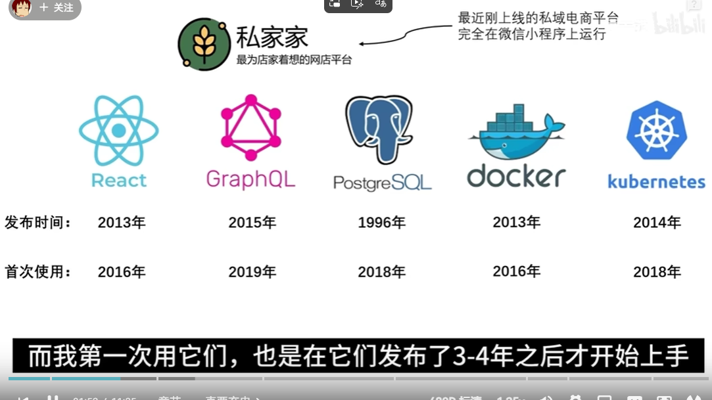

[软件架构师是怎样炼成的【让编程再次伟大#1】_哔哩哔哩_bilibili](https://www.bilibili.com/video/BV1S34y1F7pN/?spm_id_from=333.1387.upload.video_card.click&vd_source=c7ebf7408123ab5de1032a62a32045bd)

运维非常重要。

真正的好东西可以带来质的飞跃。

有的新的东西只是重复造轮子，你应该去自己体会。新的技术应该先去沉淀。

云端，

阿里云存在怎样的问题？把我们的系统部署在腾讯云华为云上面？

最后，使用MinIO的开源框架，伟大的MinIO。

这样就不需要。也就是，使用接口

懂得区分合适的技术，要有取舍。

如果是线下的广告分发系统，如果是线上的网络，可以使用Kafka。技术的选择。

权衡不同的技术的利弊，不断积累经验。

不要盲目去接受新的数据库。不要那么高级。为什么MongoDB存在问题。

Keep It Simple Stupid，不需要clean code那种极端的做法。太过于抽象。

考虑扩展性。

“If I had asked people what they wanted, they would have said faster horses.”
这种字体太过分了，弯引号和直引号长得一样。

去探究客户的深层的需求。

见人说人话，见鬼说鬼话。

架构师应该着重说重点，尤其是高级的表达。

如果你面对的人不是那么专业，那么就不使用

一 六边形全掌握
软件设计，数据结构，系统架构，后端开发，前端开发，运维
这些东西全掌握全负责

二 保持充电，永远学习
真正的好东西，能给生产力带来质的飞跃
花时间去体会，感受，才能更容易辨别，筛选出这些好东西
能哥小经验：观察一个技术 3 年，如果这 3 年内能进入主流，形成生态圈，那这就是好东西

三 有宏观视野
我的理解：锻炼自己视野的本质目的是增强自己的系统设计能力

四 权衡利弊
在技术层面，没有“银弹”，实现功能需求时，需要我们判断出各个组件的好与坏
更进一步，权衡利弊不仅是技术层面，还要考虑
1. 项目周期
2. 开发预算和成本
3. 项目维护难度
这种判断能力需要前面的保持学习这一点做支撑，只有不断学习，才能积累权衡利弊时需要用到的知识

五 习惯改需求
追求简单，反对过度抽象
能哥小技巧：不影响效率和成本的前提下，设计上应该尽量扩大解决范围

六 懂业务
懂业务的目的是挖掘出问题的根源

七 跟不同的人说不同的话
一个公司里大概有项目负责人，部门负责人，客户负责人，实际使用人这些角色
要学会提炼重点，说出对方关心的信息
跟对方沟通时，要思考怎么让对方能听懂

