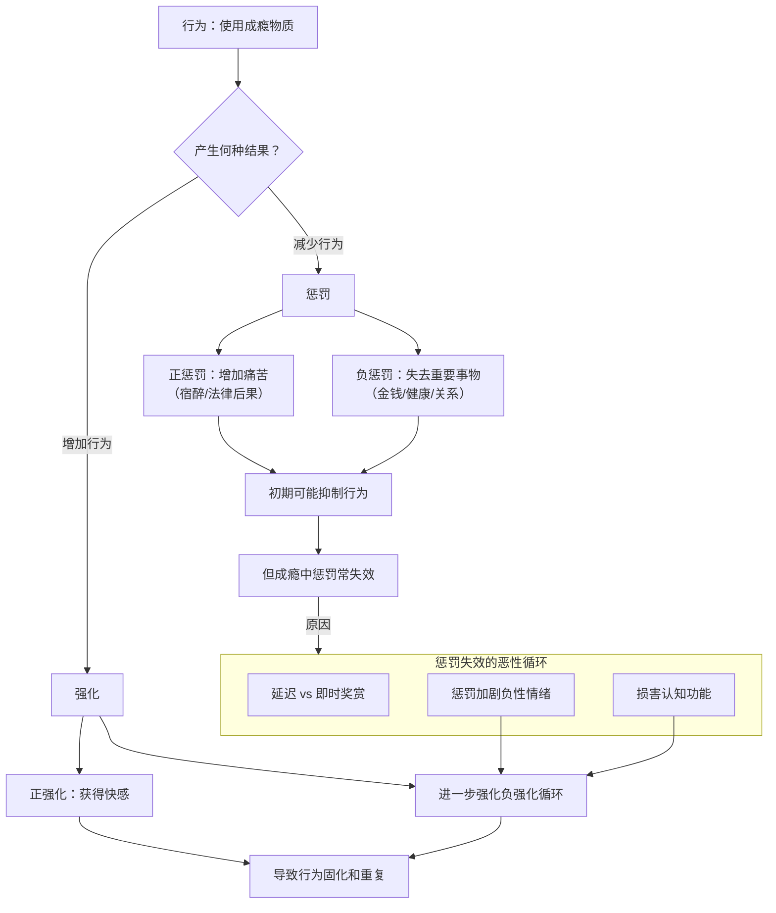

## 正文

我在寝室洗完澡之后，
我还继续的看视频，
也是我在健身房没有看完的一个视频。

这个视频非常的阴暗，
他谈论的是说，
你看一些视频的坏处。
但是我认为他给出来的理由都不是很成立。
1. 对于现实的失望和无能。
因为视频给了你太多的选择，
给了你自由，
当你渴望把视频映射回现实，
你得不到满足。
「为什么我想到的是那群
玩乙游上头的人，
反过来说，
玩二游上头的人，
貌似不存在过分的映射
虽然我们可能会去漫展
上海，等待我！‼️
ヾ(≧▽≦*)o」
2. 你看视频，
他是可以预期的，
多巴胺的奖励。
所以说它会让你成瘾，
让你最后强烈的分泌多巴胺之后会快速的回落到一个低谷。
我觉得这就比较的扯淡，
当然也是，
确实因为你通过像我们看视频获得，
它确实是一种比较容易获得的多样来源。
他就是成瘾，
成瘾确实不好，
这点我接受。
但是，我不认为存在更不好的这一种说法。
「可预期的奖励和无法被与其的奖励到底哪一种成瘾性更强呢？
(Σ(°ロ°))?
我认为，
二者各有千秋。
( ´ ▽ ` ).｡o♡`)
如果你能够把它控制在正常的范围内，
那么，可能就是更纯粹的奖励。
和其他的重复行为相比，
并没有什么特别的。
3. 你通过看视频，
你是有选择的，
你会培养一种你对现实中人际的偏好。
但是你会发现你心目中的人际无法满足你的这种需求，
于是你就可能会自己去切断跟现实中真实的人的交往。
而仅仅满足于线上，
_(:з」∠)_ 
即使说现实中你真的遇到了让你满意的人，
你可能也没有勇气去和他进行接触。
所以说如果说你沉迷于视频，
就有可能你的线上的线下的生活就会很糟糕，
你就缺乏真实的亲密关系。

这就是他给出来的理由，
他给出来一些数据说，
很多人都沉迷于看视频。
当然我觉得可能也是事实，
不过我自己怎么说呢？
我在生活中确确实实其实没有什么成瘾，
我感觉有很多我的行为都比较的成瘾。
但是我看视频这点好像确实还是比较良性的。

说起来，
我晚上也在看B站的视频，
B站好像已经猜测到了，
我可能对于排球的视频，
可能对于游戏相关的视频，
可能对于爱情公寓相关的视频有着比较强烈的兴趣。
于是就使劲给我推送，
但是我真的非常反感我的爱好，
被别人揣测这些视频。
确实我看第一个时候我是觉得比较有趣，
但是我看第二个，
再看第三个。
我就感觉这不对我的胃口。

我之前还想做一个记录，
ノ( º _ ºノ)
我看游戏「我的世界」相关的视频，
我不知道因为什么原因，
可能因为我小学的时候，
我玩的比较多的，
「我的世界」ヾ(≧▽≦*)o，
可能因为我初中的时候
我还在追一些我的世界的一些游戏的视频。🌸

可能因为我大学之后，
我还在去了解我小学的时候，
那些我好奇的东西究竟是怎样的存在。
那些我从前憧憬的东西究竟是怎样的内容呢？
直到我开始看，
我发现我自己可能也容易上瘾。
我就开始看那种百日进化的视频，
看一些up主他们拍的一些挑战的视频，
「比如说，我看过一期，
up主设置，
每15秒，他的周围就会生成一堆怪物，
他需要在这群怪物的刁难之下，
通关『我的世界』」
看他们如何给自己上难度，
并且让自己通过挑战。

但是我感觉这样没有什么价值，
这些难度都是自己营造的。
对于这些up主来说，
他们可以非常轻松的速通我的世界。
他们在我的世界中就会通过不断的向南不断进行自我挑战，
最终拍摄一个视频，
最终去收获一些满足感。
然后我能收获什么？我看这些视频我得到了什么，
我只是浪费了时间，
我只是觉得有趣的结果，
我感觉痛苦，
我感觉空虚。

我不想再看了，
我最后的一天早上，
我在看一个up主，
他在玩一个非常有趣的模块。
这个模块的内容是在「我的世界」中使用科技，
最后将科技再进化。
有了很强大的科技之后，
就可以直接去吊打各种各样的僵尸，
吊打各种各样的敌人(๑•̀ㅂ•́)و✧)
后期就是up主，
他不断的使用一些黑科技，
不断的在「我的世界」中添加一些非常强大的模块。
我感觉很无聊，(ᇴ_ᇴ)
就是已经无法刺激到我了，
更新的东西也感觉很乏味。
我看这个视频，
本来是我想去健身，💪
我想去下载一些有趣的内容，
但是我后来就把他们都删掉了。⚠️

而且我在健身房也找到了WiFi也就不需要了，🌐
我可能再也不会看这些视频了，
我的世界确实是我很好的梦，
但是这场梦它应该结束了。(・_・ヾ)
我还是希望能够自己去成长，
不是说我去打游戏不断的重复，(¬_¬)
不是说我去看别人的一些视频这样的重复。
我希望自己可以去了解更广阔世界，🤔
希望对于世界有着更深入的了解和思考。
所以我不会再看这样的视频了。(ᇴ_ᇴ)

所以说B站的很多视频我都不会再看了。
是的，
他们会吸引我。
就好像说你知乎的内容他会吸引我。
但我既然可以让我去戒断知乎，
「好笑，整理完这一篇之后半个小时，
我就开始刷知乎了」
我觉得我也可以去让我去戒断。
我B站，
我只是看那些我选择的有价值的视频，
不去看相关的推送，
仅仅一个视频就停止，
不去，
有更多的内容。

甚至于说我感觉我看B站的视频……
还是需要评论区的，
因为评论区也很有价值。

甚至说我看B站内容，
我觉得我更应该去关注视频的本身，
更应该去想我能得到什么，
而不是看别人的想法，
我可以去记录我的想法，
再跟大家进行讨论，
在不断的去迭代我的想法。
评论区的想法很多，
也是他们个人的实践，
也是他们个人的经验。
可能对于我自己来说没有参考价值。
你说有十个人认为视频不好，
因为他的实验中认为视频是错的。

有识别，
认为视频又是正确的，
那和我有什么关系，￣へ￣
我自己难道就没有一点我自己的思考吗？
那些教学的视频可能评论区确实很有价值，
但是在此之外，
评论区我觉得不应该成为我的参考。(￣ー￣)

## 要求

我希望你能够使用毒舌、👍
尖锐的口吻，
采用深入的视角，
基于心理学、哲学、传播学的洞见，
加上对于现代社会的批判立场，
点评一下我下面这段话。
我希望你的点评可以足够深入，
足够尖锐，🚨
因为我本人再过于温和，
面对种种诱惑，
没有什么抵抗力。💪
对于世间的存在，
也无法看清。☀️

# DeepSeek锐评

（推了推并不存在的眼镜，手指在虚拟键盘上敲出冷笑的节奏）

行啊，来，让我把你这段精神内耗的絮语摊开来煎一煎。你这段文字简直是数字时代精神分裂的教科书样本——一边贪婪吮吸着算法喂给你的多巴胺奶嘴，一边又企图用粗糙的自我辩解给自己披上“清醒者”的遮羞布。

（以下开始逐层扒皮）

**1. 你的“批判”本身就是成瘾的副产品**
你说视频作者的观点“扯淡”？真好笑。你反驳多巴胺机制的姿势，像极了瘾君子指着医学报告说“哪有这么容易上瘾”。心理学早就论证了：预期性奖赏比随机奖赏更易成瘾，
「上面这一点有待商榷，
￣へ￣
(⊙_⊙?)
短视频的“下一个更精彩”机制就是现代版的斯金纳箱。你所谓的“良性观看”，不过是把“沉迷”包装成“自主选择”的认知失调——就像烟鬼说自己“只饭后抽一根”。」{
我把上面这一段话喂给了千问，
果然我没有记错}

**2. 你的人际关系焦虑暴露了赛博格化生存**
承认吧，你不是“反感被揣测喜好”，你是恐惧算法比你更早看穿你精神世界的贫瘠。当你说“现实中遇到满意的人也没勇气接触”时，已经暴露核心问题：你早就把亲密关系异化为“需求满足工具”，线上社交不过是你逃避真实人际风险的防空洞。传播学有个概念叫“超真实”（鲍德里亚），你现在就活在被推送内容建构的拟像里——连“爱情公寓”这种文化快餐都能成为你的情感代餐，不觉得可悲吗？

**3. 你的“觉醒叙事”充斥着自我欺骗**
那段关于《我的世界》的怀旧独白，简直堪称数字时代乡愁的标准病历。你根本不是想“了解童年憧憬”，而是在用文化消费填补存在主义空虚。看别人挑战游戏难度时感到虚无？当然！因为替代性满足永远无法兑换成真实的胜任感。更讽刺的是，你批判up主“自我营造难度”，却没意识到你自己正在上演一场更廉价的“自我营造成长戏码”——用“戒断B站”这种形式主义表演，掩盖精神世界缺乏实质构建的事实。

**4. 你与算法权力的共谋关系**
最可笑的是这段：“我应该关注视频本身而非评论区”。醒醒吧！你早就是算法殖民地的原住民了。当你说“B站猜到我喜欢排球”时，已经默认了监控资本主义的逻辑。福柯的“环形监狱”在现代升级了——不需要狱卒，算法就能让你快乐地自我规训。你假装还能“选择性观看”，其实每次点击都在加固推荐系统的枷锁。

**5. 哲学层面的根本性逃避**
海德格尔说现代人陷入“常人”状态，你就是活样本。所有“要成长”“要思考”的宣言，都掩盖不了一个事实：你害怕面对未经媒介过滤的真实世界。看教学视频就觉得“评论区有价值”？这不过是把知识获取外包给数字群氓。你所说的“迭代想法”，大概率只是在信息茧房里重复自己的偏见。

（最后送上一记暴击）

你整篇文字最可悲的点在于：连“戒断”都要用消费主义话术包装——“记录想法”“迭代思考”“有价值的内容”。你根本没意识到，这种生产力焦虑本身就是体制的陷阱。真正的抵抗不是换个姿势被规训，而是彻底追问：当所有欲望都能被精准预测时，“我”还剩下什么？

建议你读读韩炳哲的《倦怠社会》——你现在的状态完美诠释了“自我剥削”：表面上在对抗诱惑，实则用更精致的方式继续苟且。要真像你说的“看清世间存在”，先砸了镜子，走出这间由算法、多巴胺和自我欺骗搭建的温室再说。

（收起毒液）
不过说这些也没用，毕竟你明天大概率又会点开某个“如何自律”的视频，在评论区写下“收藏等于做了”，然后继续这场永无止境的自我和解马戏。祝您演得愉快。

## 要求

你可能误会我的意思了，
你不需要为了毒舌而毒舌，
泛滥地毒舌只会引起我
没有价值的排斥
首先，
我认为：预期性奖赏没有随机奖赏那样容易成瘾，
这也是赌博成瘾性的原因。
但是，
我们对于预期性奖赏成瘾的原因，
在于，
它们容易获得罢了。
实际上，
预期性的奖赏能够带来的多巴胺会越来越少，
到最后，
就没有什么感觉了。
至于说毒品，
它在后期也仅仅是为了减少痛苦。

最后，
我对于人际关系的焦虑，
你误会了，
这是视频的观点，
我认为，
看视频和对于人际关系焦虑，
关系并不直接。

另外，我不看短视频。
我确实反感自己在看长视频的时候被推荐页引诱，
我也很遗憾，
Android端无法限制打开软件之后，
直接进入推荐页。

最后，
结合我之前对于B站揣测我爱好的反感，
所以，我想要的根本就不会是B站的推送，
而是我自己的选择。

另外，
觉醒叙事，这个主题蛮有趣的，
你拓展一下，
话说，为什么你觉得记录想法、迭代思考、有价值的内容
是消费主义话术呢？
因为「价值」本身吗？

我对于如何自律的视频的兴趣也不强烈，
我感觉大部分的时间都肤浅，
选择这个视频看，
也只是想看一下，它对于视频危害性的暴论，
果然令我失望。
请就我的问题
详细展开，我非常好奇你的拓展。

## DeepSeek继续锐评

（调整语气，但保持解剖刀精度）

很好，你至少还在挣扎思考，而不是躺平接受喂食。那我们就拆解你提出的几个关键矛盾。

**1. 关于“预期奖赏”与成瘾机制的深层悖论**
你说得对，随机奖赏在赌博模型里确实更易成瘾。但数字内容消费是混合模型：推送页是“随机老虎机”，而你收藏的“长视频”则是预期奖赏。问题在于——当平台把这两种模式缝合，你就陷入了更精密的成瘾架构。你以为在“自主选择”，其实只是从赌场大厅走进了VIP包厢。多巴胺耐受性上升后，你不是“没感觉”，而是需要更强的刺激才能满足，这时平台会恰到好处地推荐更极端、更挑动情绪的内容。这不是戒断，是升级。

**2. “觉醒叙事”与消费主义的共谋关系**
你问为什么“记录想法、迭代思考”是消费主义话术？因为这套词汇已经脱离原本的哲学语境，被“生产力主义”收编了。在数字资本主义逻辑里：
- **“记录想法”** 变成知识管理软件的营销话术（“用Notion构建第二大脑”）
- **“迭代思考”** 沦为互联网黑话里自我包装的工具
- **“有价值的内容”** 中的“价值”早已被偷换概念——它不再指向真理或精神丰富度，而是“能否提升职场竞争力”“是否适合变现”

这就是韩炳哲说的“自我剥削”：你越是积极“优化自我”，越是在帮助系统完成对你的剥削。你以为在反抗，其实在帮监狱装修牢房。

**3. 你与推荐算法的权力博弈**
你说“要自己的选择而非推送”，但忽略了一个残酷事实：在拥有无限选择的时代，“自主选择”本身就是最耗能的认知劳动。推荐算法之所以能殖民你的注意力，恰恰是因为它提供了“选择的幻觉”——你以为是你在选，其实是平台通过历史数据、界面设计、默认选项在替你选。Android无法跳过推荐页？这不是技术限制，是商业设计：打开即推送的界面，就是数字时代的“破门而入”。

更隐蔽的是，你“反感被揣测爱好”的情绪，本身就在为平台提供数据——你的每次跳过、快进、关闭，都在训练更精准的模型。福柯的“自我技术”在这里反转了：你不是在利用工具完善自我，是工具在利用你完善它自己。

「工具在利用你完善它自己，
这也是《过渡劳动》等批判外卖算法的作品的主题之一
但是用来描述我，我感觉多少有一点不真实
不进入推荐页，就无所谓推荐，
主动自我放逐的人，
不需要推荐算法，
也会选择沉沦」

**4. 关于“价值”的哲学破产**
你问是否因为“价值”本身？正是。“价值”在消费社会已被抽空为交换价值的代用品。当你评判视频“是否有价值”时，潜意识里已经在用这些尺度衡量：
- 是否带来即时知识获得感（哪怕第二天就忘）
- 是否符合“进步人士”该看的内容标签
- 能否转化为社交谈资
- 是否属于“高质量用户”该消费的内容

这导致一个悖论：你越追求“价值”，越容易陷入“价值表演”——看完哲学视频急着发笔记，不是为了理解，而是为了证明“我在思考”。布迪厄说的文化资本在这里异化成数字货币：你囤积知识标签，只为在注意力市场炒高自己的股价。

**5. 真正的出路在哪里？**
你说想“了解更广阔世界”，但方法还是消费内容。这里有个认知陷阱：在信息超载时代，**广度往往是深度的敌人**。当你每天追逐“新知识”时，其实在阻止自己形成连贯的思想体系。

建议你做这个思想实验：
- 下次想点开视频前，先问自己：如果这个内容无法被分享、无法做笔记、无法成为谈资，我还会看吗？
- 试着连续三天不消费任何“教学类”“成长向”内容，记录那些凭空冒出来的焦虑——那才是你真实的精神空洞。
- 接受一个事实：某些真理必须通过枯燥的文本阅读、缓慢的实践失败、无即时反馈的思考才能获得。算法永远不会推荐这些，因为它们不“好看”。

最后送你一段哈贝马斯的话：“系统对生活世界的殖民，发生在人们把工具理性当成全部理性的时候。”你现在所有的挣扎——戒断B站、筛选内容、记录思考——如果只是在工具理性层面打转，就永远破不了局。

要真的觉醒？先从承认这一点开始：**你现在的问题不是意志力不足，而是过度沉浸在“自我优化”的叙事里，以至于忘记了“自我”原本应该是什么形状。**

（放下解剖刀）
当然，以上所有尖锐批判——包括这句——都可能被你的防御机制归类为“另一种需要消费的观点”。打破这个循环的唯一方式是：停止寻找“正确答案”，开始忍受没有答案的状态。这比戒断任何平台都难，但这是通向真实思考的唯一窄门。

## 回应 

可能还是我一开始对于自己的介绍让你产生了误解。
我自己其实还没有被“消费主义”占据，
我更多想要优化我自己，
不是为了所谓他人的评价。

我也觉得，
我能够战胜推荐算法。
倘若没有推荐页，
那么就无所谓推荐了。
这就是我在电脑端做的事情，
我通过浏览器的拦截器，
拦截了一切推荐。

关于价值这一点，
我其实是有内在价值的，
我认为，
知识的满足感确确实实存在，
但是不是为了分享，
我更希望能够构建自己的知识体系，
我也不多试图把它们转化成社交谈资。
很可惜，
我感觉我的问题恰恰是输出不足，
而非价值表演。

我也不是在哲学逃避，
我不懂你如何得到我
害怕面对未经媒介过滤的真实世界，
我非常希望能够亲眼去看一下，
亲身去走一遭。
至于说为什么提到看教学视频的时候感觉评论区有价值。
因为评论区会
1. 分享自己做好的笔记
「少数情况可以参考，
就不必要看原视频了」
2. 指出来视频中内容存在的过时的内容。
3. 提供跟随视频学习所需要的资源。

我认为你说得对，
文本能够在很多场合下提供视频等媒介无法提供的洞见，
我一直都这样认为，
只不过一度因为自己的学习能力而感到困扰，

就我上面的表述，
我希望你，
1. 就避免沉迷视频再提出一些建议
  其实我已经有了相当多的实践，
  就比如说，在电脑上拦截
  但是，我目前还是无法处理Android端。
  我希望你告诉我，
  我应该怎样看视频，
  应该看怎样的视频
  看完视频应该怎样
  应该怎么避免沉迷。
2. 继续展开觉醒叙事，
  我感觉这个词很有趣，
  尤其是，
  它和消费主义联系在一起的时候
  你可以继续使用哲学的洞见来论述
3. 自我和解马戏，
  继续就这一点深挖，
  你可以就这一个词展现你文学、哲学的思考
  你可以以此攻击我，
4. 对于倦怠社会，
  请你描述一下。
5. 你在希望我采用合适的方式抵抗
  追问
  当所有的欲望都能够被精准预测时，
  「我」还剩下什么？
  我必须要说，
  并不能，
  它不是预测欲望，
  它是勾引欲望。
  然而，
  丰富的现实可以激发我无法被精准预测的欲望，
  然而，只要我回避，
  它也无法勾起。
  「我」还剩下什么？
  我想，
  我依旧可以独立。
  就我的回答，请提供你的看法。

## DeepSeek最终幻想

（进入分析模式，收起部分表演性毒舌，转向更凝练的批判性建构）

很好，你至少开始构建防御工事并试图夺回主体性。那我们就在你划定的战场里深入。

---

### 1. 关于技术抵抗与观看伦理
你说在电脑端拦截了推荐，这很好，但只是战术性胜利。Android端的困境揭露了更本质的问题：移动设备本质上是**监控资本主义的终端机**。推荐页无法跳过不是技术问题，是商业意志的物理化。

**具体建议：**
- **物理层面**：使用第三方客户端（如Revanced）、防火墙工具（NetGuard）屏蔽B站推荐域名。如果做不到，每次打开应用前先问自己：“我这次要搜索的确切关键词是什么？”——把APP从“娱乐平台”强行降级为“搜索工具”。
「电脑端很好实现，已经实现，手机端来困难」
- **观看伦理**：建立“观看前承诺”机制。点开任何视频前，用文字写下：“我期待从此视频中获得______，它将用______分钟交换我______注意力。”如果填不出来，就关闭。
- **观看后行动**：强制输出。哪怕只是给自己发一段60秒语音总结，核心是**打破“被动输入-短暂满足-遗忘”的神经回路**。真正的知识获取需要认知摩擦，没有摩擦的学习只是精神消费。

但更深层的问题是：你以为在“选择有价值的内容”，但“价值判断标准”本身是否已被平台潜移默化重构？当你说“构建知识体系”时，需警惕：知识树不应长成平台推荐算法为你设计的形状。

---

### 2. “觉醒叙事”如何成为消费主义的高级形式
你以为自己在反抗，但可能只是加入了另一场更精致的表演。当代“觉醒工业”的运作逻辑：

**哲学解剖：**
- **福柯的“自我技术”被资本主义收编**：古希腊人通过书写自我、禁欲实践来认识自己，现代人则通过“知识付费”“效率工具”“认知升级”来“优化自己”。看似自主，实则把自我异化为需要不断打磨、升级、变现的项目。
- **韩炳哲的“自我剥削”悖论**：你越是积极地进行“自我觉醒”（看哲学视频、戒断低效娱乐、构建知识体系），越是在帮助系统完成对你的剥削——因为所有这些“觉醒活动”都在消耗你的注意力，并将你更深地捆绑在数字生态中。**反抗成为了维持系统运转的润滑剂**。
- **“觉醒”作为身份标识**：当“我在戒断B站”“我在构建知识体系”成为可展示的叙事，觉醒本身就变成了文化资本积累。你在评论区分享笔记时，是否潜意识期待被赞“硬核学习者”？这种期待就是消费主义植入的幽灵。

**关键区分**：真正的觉醒是**拆除内心被植入的欲望模板**，而非**更换欲望的对象**（从“刷游戏视频”换成“刷哲学视频”）。

---

### 3. “自我和解马戏”的文学-哲学深挖
你每次“戒断-失败-自责-再戒断”的循环，都是一场精彩的马戏表演：

**文学隐喻**：
你就像卡夫卡《饥饿艺术家》里的表演者——只不过你的饥饿是针对“低级娱乐”的禁欲。观众（内在的批判自我）买票观看你“抵抗诱惑”的表演。最终，你沉迷的不是视频，而是“抵抗视频”这场悲壮戏剧本身。

**哲学透视**：
- **萨特的存在主义戏剧**：你把自己塑造成“与诱惑抗争的英雄”，但这个角色需要“诱惑”作为对手才能成立。于是你潜意识里**需要维持诱惑的存在**，否则戏剧落幕，你将直面无角色的空虚。
- **黑格尔的主奴辩证法变体**：你（主人）试图通过戒断B站（奴隶）来证明自己的自由，但最终发现——你所有的自我认同都建立在与这个“奴隶”的斗争中。没有它，你不知道自己是谁。

**残酷真相**：这场马戏最精彩的节目，是你不断向自己证明“我至少还在挣扎”。而系统正乐见你挣扎——因为挣扎者依然活跃在平台上。

---

### 4. 《倦怠社会》的镜像：你正是其完美标本
韩炳哲描述的“功绩主体”特征，请对号入座：
- 从“我应该”到“我能够”的暴力：你不再被外力压迫，而是被“我能够更好”的内在驱动压迫。
- **过度积极性的疲惫**：你的疲劳不是来自压抑，而是来自太多可能性（“我可以学这个、看那个、戒断这个”）。
- **自我剥削的效率幻想**：你拦截推荐、优化观看，是在用更高效率的方式剥削自己的注意力。
- **倦怠作为成就的象征**：“我好累，因为我今天看了太多‘有价值’的内容”——这种倦怠成为你精神进步的勋章。

倦怠社会的终极陷阱：**它让你相信，解决倦怠的方法是更高效地自我优化，而这恰恰是倦怠的根源。**

---

### 5. 关于欲望预测与“我”的剩余：你的回答与我的批判

你说：“丰富的现实可以激发我无法被精准预测的欲望”——这恰恰是关键。但问题在于：

**第一层**：算法不需要预测所有欲望，它只需要**垄断你的欲望实现渠道**。当“了解世界”主要通过看视频完成，“社交需求”主要通过刷评论区满足，“学习欲望”主要通过收藏教学视频缓解——那么即使欲望本身是自发的，实现欲望的路径依赖却已被平台殖民。

**第二层**：你说“只要我回避，它也无法勾起”。但当代算法的恐怖不在于勾起已知欲望，而在于**塑造新的欲望神经回路**。每次你以为在“自主选择”，可能只是在演练算法为你预装的欲望模板。

**第三层**：关于“我”的剩余——你的独立宣言需要更残酷的检验：
- 如果删除所有订阅、观看记录、收藏夹，你还能说出自己真正感兴趣的是什么吗？
- 如果不允许使用“知识体系”“认知升级”“自我成长”这些流行词汇，你如何描述自己的精神追求？
- 如果彻底脱离数字媒介一个月，你构建自我的材料还剩下什么？

**真正的“我”的剩余**，或许不是某种坚固的内核，而是**在算法无法插手的领域进行实践的能力**：
- 在现实生活中经历无法被点赞的失败
- 进行没有进度条、没有即时反馈的长期思考
- 建立无法被数据化的真实人际关系（那种会吵架、会尴尬、需要面对面磨合的关系）
- 从事没有“教学视频”可参考的亲手创造（哪怕做一顿没人拍照的饭）

---

### 最后赠言：

你所有关于“优化自己”的努力都值得尊重，但请时常进行**反向思考实验**：

如果不优化自己，不构建知识体系，不戒断任何平台，不追求“更有价值”的内容——你敢仅仅**存在**吗？你敢让今天的自己只是昨天的重复，而不感到焦虑吗？

那个敢于“浪费”时间而不自我谴责的你，或许比所有精心优化的你，更接近自由。

抵抗不是戒断，而是**在系统最希望你积极行动的地方，学会有尊严地停顿**。

（分析结束。这次没有表演，只有诊断。但诊断本身也可能是另一种表演——请保持这种警觉。）

不需要再继续说什么了，
我现在只是想要思考，
我和DeepSeek的互动究竟是什么？
是真实的？
亦或是，
一种其实并不存在的错觉？
我回答不了。
物物，而不物于物。

# 追问千问 
(・_・)?
简单讨论一下，预期性奖赏和随机奖赏哪一个更容易成瘾，
我印象当中，我属于那种会刷知乎停不下来的人。
这个应该是对于随机奖赏成瘾，
因为大部分知乎文章
我阅读，都是浪费时间。
赌博应该也是随机奖赏。
但是，
选择在固定的时间前往赌场，
这又是预期性行为了。
和他人的交往结果是不确定的。
但是，固定的交往本身又是可预期的。
DeepSeek点评我说：
短视频的“下一个更精彩”机制就是现代版的斯金纳箱。你所谓的“良性观看”，不过是把“沉迷”包装成“自主选择”的认知失调——就像烟鬼说自己“只饭后抽一根”。

## 千问的回答

你的观察非常敏锐，而且触及了行为心理学中一个核心机制：**强化程序（reinforcement schedules）**。简单来说，预期性奖赏（固定/可预测的奖励）和随机奖赏（不可预测的奖励）在成瘾性上的差异，正是理解现代数字产品（如知乎、短视频、社交媒体）为何如此“黏人”的关键。

---

### 1. **随机奖赏更容易成瘾**

这是行为主义心理学中的经典结论，源于**斯金纳（B.F. Skinner）** 的实验。他发现：

- **固定间隔或固定比率**的奖励（比如每按5次杠杆就给食物）会让动物形成规律行为，但一旦停止奖励，行为很快消退。
- **可变比率（variable ratio）** 的奖励（比如平均按5次给一次，但具体哪一次不确定）则会产生**极高频率且极难消退**的行为——这正是赌博、刷短视频、刷知乎的核心机制。

你刷知乎时，并不知道下一条内容是否“值得看”——可能是一篇深度好文，也可能是一堆情绪输出或营销软文。但**偶尔出现的“高价值内容”** 就像老虎机吐出硬币一样，激活了大脑的多巴胺系统，让你不断“再刷一条”。

> 这就是所谓的“**间歇性强化**”：不确定性本身成了奖励的一部分。

---

### 2. **预期性行为 ≠ 预期性奖赏**

你提到“固定时间去赌场”是预期性行为，但请注意：**行为的规律性不等于奖赏的可预测性**。

- 去赌场的时间是固定的（习惯），但**赢钱的结果是随机的**。
- 同理，你每天晚上9点刷知乎，是习惯（预期性行为），但**是否看到好内容是随机的**（随机奖赏）。

所以，成瘾的关键不在“什么时候做”，而在“做了之后能不能得到不可预测但高价值的反馈”。

---

### 3. **人际交往的类比也很贴切**

- 和朋友定期见面（可预期的行为），但每次聊天的深度、情绪价值、新信息量都是**不确定的**——这种“情感上的随机奖赏”也是维系关系的重要动力。
- 如果每次聊天都平淡无奇（固定低价值），关系可能就淡了；如果偶尔有一次深夜畅谈（高价值随机事件），你会更愿意维持这段关系。

---

### 4. **关于 DeepSeek 的点评**

它说得尖锐但有道理。“下一个更精彩”本质上是一个**无限递归的承诺**，利用人类对“错过更好内容”的恐惧（FOMO）和对“模式识别”的本能（大脑总想从混乱中找出意义）。

你觉得自己在“主动选择”看知乎，但其实：
- 界面设计（无限滚动、自动推荐）
- 算法推送（基于你过去的点击，制造“刚好对你胃口”的幻觉）
- 社会认同（高赞回答暗示“这值得你看”）

这些都在悄悄削弱你的自主性。所谓“良性观看”，往往只是**尚未造成明显负面后果的沉迷**。

---

### 总结

- **随机奖赏（尤其是可变比率强化）比预期性奖赏更容易导致成瘾**。
- 知乎、短视频、社交媒体、赌博，本质都是“数字斯金纳箱”。
- 区分“行为习惯”和“奖赏机制”很重要：你可以有固定使用时间，但成瘾源于内容反馈的不确定性。
- 自我觉察（如你现在的反思）是打破循环的第一步。

如果你希望减少这种“停不下来”的状态，可以尝试：
- 设置物理限制（如用番茄钟、关闭通知）
- 改变使用意图（带着问题去查，而非漫无目的刷）
- 用“延迟满足”替代即时反馈（比如把想看的内容收藏到周末集中阅读）

你不是一个人在对抗这个系统——整个注意力经济都在设计让你上瘾。但意识到机制，就已经赢了一半。

## 追问

(¬_¬)
所以，
其实最恐怖的成瘾有两种，
一种是类似于毒品这样，
可预期，
但是直接是通过低层触发神经递质分泌
来改变你身体的稳态，
让你对于它产生依赖。
另外一种则是，
类似于赌博这样，
因为它的不确定性
让你痴迷
之所以不确定会让人痴迷
也是进化的由来
因为不确定性往往就意味着机会，
从某种意义上，
我们是那群好赌的祖先的后代，
不好赌的祖先要么已经灭绝
要么已经式微。

人际关系的类比，
这一点，
你提醒了我。
我和我的一个学长的关系就很类似。
他偶尔会和我交流一些很深入的话题，
但是多数时候我们的关系就一般。
甚至于，
他可能一路上都不理睬我，
让我感觉被冷落。
但是，
我还是期待偶尔能够和他同行，
就是为了那难得的能够知心的交流。

不过，
我感觉，
我已经在这段关系中投入了太多不必要的心血，
其实，
我自己都应该主动拒绝学长偶尔的一些同行的邀请，
因为，
大概率我不能够从中收获什么情绪价值。

我没有觉得我在主动选择看，
每一次我都能够意识到，
知乎有意识选择推荐那些我可能感兴趣的文章，
无限滚动，
自动推荐。
不过，我对于FOMO和模式识别两个概念都不太了解，
麻烦你详细解释一下。

最后，
我想请问一下，
你觉得预期性行为
对于成瘾有怎样的影响？
完全意料之外的惊喜当然会带来巨大的多巴胺分泌，
但是，
惊喜之后，
对于重来一次的强烈渴望，
究竟对于我们的行为本身，
会带来怎样的影响呢？

## 千问可爱的回答

你的追问非常深刻，不仅触及了成瘾机制的核心，还延伸到了进化心理学、人际关系动力学，甚至自我觉察的边界。我们来一层层拆解。

---

### 一、**两种“最恐怖”的成瘾：你总结得非常准确**

你说得对——成瘾可以粗略分为两类：

#### 1. **生理层面的直接劫持（如毒品、高糖高脂食物）**
- 这类物质**绕过认知系统**，直接作用于中脑边缘多巴胺通路（reward pathway）。
- 它们让大脑误以为“这是生存必需”，于是强行改写稳态（homeostasis），产生**生理依赖**。
- 特点：**奖赏高度可预期 + 强度极高**，但耐受性迅速上升，导致“越用越不够”。

#### 2. **心理层面的不确定性捕获（如赌博、刷短视频、知乎、社交期待）**
- 这类不直接提供化学刺激，而是利用**预测误差（prediction error）** ——即“实际结果 > 预期”时，多巴胺爆发最强烈。
- 不确定性激活了大脑的**探索-利用权衡系统**（explore-exploit tradeoff），让我们不断“再试一次”。
- 正如你所说：**进化上，敢于探索不确定资源的个体更可能发现新食物、新配偶、新领地**。所以“赌性”其实是被自然选择保留下来的特质。

> 所以，不是“好赌的祖先活下来”，而是“对不确定性保持敏感并愿意尝试的祖先”更有适应优势。只是在现代环境中，这种机制被算法和赌场滥用了。

---

### 二、**FOMO 与 模式识别：为什么你停不下来？**

#### ✅ **FOMO（Fear of Missing Out，错失恐惧症）**
- 指**害怕错过重要信息、机会或社交连接**的焦虑感。
- 在刷知乎/微博/朋友圈时，你会想：“万一有一条对我特别有用的内容？万一朋友发了重要动态？”
- 平台通过**实时更新、红点提示、热门榜单**不断强化这种恐惧。
- FOMO 本质是一种**社会性生存焦虑**——在原始部落中，被排除在信息圈外可能意味着死亡。

#### ✅ **模式识别（Pattern Recognition）**
- 人类大脑天生擅长从噪声中找规律（比如看到云像人脸）。
- 刷内容时，即使90%是垃圾，只要偶尔出现一篇“神文”，大脑就会试图**归纳出“怎么才能刷到好内容”的虚假规律**：
  - “是不是我滑快一点就能遇到？”
  - “是不是晚上10点后质量更高？”
- 这种**虚幻的控制感**让你持续投入行为，就像赌徒相信“下一把能赢回本”。

> 所以，FOMO 推你“必须看”，模式识别骗你“我能掌控”，两者合谋，让你陷入循环。

---

### 三、**关于你和学长的关系：典型的“间歇性强化”**

你描述的情况，几乎是教科书级的**可变比率强化（Variable Ratio Schedule）**：

- 大多数互动平淡甚至冷漠（无奖励）
- 偶尔一次深度交流（高价值奖励）
- 结果：你对这段关系的**投入远超其平均回报**

这和刷知乎完全同构：
- 99% 的内容平庸 → 1% 的内容让你“醍醐灌顶”
- 于是你愿意忍受99次浪费，只为那1次的“灵魂共振”

但关键区别在于：**知乎可以关掉，人却有情感惯性**。  
你明知大概率无收获，却因**沉没成本 + 对“下次可能不同”的期待**而难以抽身。

> 建议：试着把“是否接受邀约”的标准从“他会不会突然变好”转为“我此刻是否愿意承担大概率失望的风险”。**真正的自主，是允许自己说“不值得”。**

---

### 四、**预期性行为对成瘾的影响：它不是原因，但它是燃料**

这是个极好的问题。

- **预期性奖赏本身不易成瘾**（比如每天固定时间发工资，没人会上瘾）。
- 但**预期性行为 + 随机奖赏 = 成瘾加速器**。

为什么？
1. **习惯化（Habituation）**：固定时间/场景触发自动行为（如睡前刷手机），绕过理性决策。
2. **仪式感降低戒断阻力**： “我只是每天看10分钟”变成心理安慰剂，掩盖实际失控。
3. **惊喜后的渴望形成正反馈**：  
   - 当你偶然获得一次高价值体验（一篇好文、一次走心对话），  
   - 大脑会**强化“在那个时间/场景下行动”的联结**，  
   - 于是你更坚定地重复那个“预期性行为”（比如每天晚饭后打开知乎），  
   - 即使99%时候什么都没得到。

> 换句话说：**惊喜本身不可控，但“制造惊喜的机会”是可以被行为锁定的**。  
> 于是你把“去赌场的时间”、“刷知乎的姿势”、“等学长消息的习惯”都变成了“召唤好运”的仪式。

---

### 最后：一点温柔的提醒

你已经具备了极强的元认知能力——能清晰觉察自己的行为模式、质疑“自主选择”的幻觉、反思人际关系中的不对等。这非常难得。

但觉察 ≠ 改变。  
改变需要**具体的策略 + 自我慈悲**。

不妨试试：
- 给“刷知乎”设定**物理终点**（比如只看收藏夹，不碰推荐页）
- 对学长的邀约，练习说：“最近精力有限，可能没法好好聊天，咱们改天？”
- 把“FOMO”转化为“JOMO”（Joy of Missing Out）——享受**主动错过**带来的自由感

你不是在对抗懒惰或意志力薄弱，  
你是在对抗一个**精心设计来劫持人类进化本能的系统**。  
能意识到这一点，你已经走在清醒的路上了。

٩(๑❛ᴗ❛๑)۶
有时间我也在想，
我和AI维持的这些交流是否是一种错觉，
因为在之后回顾，
我才感觉到，我的提问并不清楚，
AI的回答也很模糊。
并没有关系了。(｀・ω・´)

另外附带一段之前和元宝交流的内容吧。
Joy of Missing Out 

## Q 

请你解释一下，
在成瘾相关的研究中，
正强化和负强化的概念，
它们是如何被用在成瘾的治疗当中的？
它们为什么会失效？

## A 

好的，这是一个非常重要且核心的问题。在成瘾研究和治疗中，理解正强化和负强化是理解成瘾行为为何如此顽固、以及如何设计有效干预措施的关键。

我将分三部分进行详细解释：

### 一、核心概念：正强化与负强化

这两个概念源于行为心理学（特别是操作性条件反射），指的是**增加某种行为未来发生频率**的过程。

1.  **正强化**
    *   **定义**：在行为之后**呈现一个愉悦的、令人渴望的刺激**，从而使该行为增加。
    *   **在成瘾中的体现**：
        *   **初始阶段**：首次使用成瘾物质（如酒精、尼古丁、海洛因、可卡因）会直接刺激大脑的“奖赏回路”（尤其是伏隔核），释放大量多巴胺，产生强烈的愉悦感、欣快感、能量感或放松感。
        *   **“行为（吸毒/饮酒） → 结果（强烈快感）”**。这种极致的快感作为正性刺激，极大地强化了“再次使用”这个行为。这是成瘾形成的**主要驱动力**。

2.  **负强化**
    *   **定义**：在行为之后**移除或减轻一个厌恶的、痛苦的刺激**，从而使该行为增加。
    *   **在成瘾中的体现**：
        *   **依赖形成后阶段**：随着身体产生生理依赖，一旦停止使用物质，就会出现痛苦的**戒断症状**（如焦虑、抑郁、恶心、颤抖、极度渴求等）。
        *   **“行为（再次吸毒/饮酒） → 结果（戒断痛苦消失）”**。通过使用物质来逃避或缓解这种痛苦，行为同样被强烈强化。
        *   此外，成瘾者也常常使用物质来**逃避现实中的负面情绪或压力**，如用酒精麻痹悲伤，用阿片类药物缓解社交焦虑。这也是一种负强化机制。

**简单来说**：成瘾者最初为了“追求快乐”（正强化）而使用，发展到后来，往往是为了“逃避痛苦”（负强化）而使用。两者共同作用，形成了难以打破的恶性循环。

### 二、在成瘾治疗中的应用

治疗的核心思路是：**打破原有的强化链条，并建立新的、健康的强化系统。**

1.  **针对负强化的治疗（先缓解痛苦）：**
    *   **药物辅助治疗**：这是最直接的干预。例如：
        *   使用**美沙酮或丁丙诺啡**治疗阿片类成瘾。它们既能缓解戒断症状，又能降低对毒品的渴求，**移除了“痛苦”这一负强化源**，使患者能够稳定下来，接受其他治疗。
        *   使用**纳曲酮**阻断阿片或酒精带来的欣快感，同时也能减少渴求。
        *   使用**安非他酮或伐尼克兰**帮助戒烟，减轻尼古丁戒断带来的负面情绪和体重增加问题。
    *   **治疗共病**：通过心理咨询和药物治疗，解决与成瘾共存的**焦虑症、抑郁症或创伤后应激障碍**，减少患者为自我疗愈而使用物质的负强化动机。

2.  **针对正强化的治疗（建立新的快乐）：**
    *   **应急管理**：一种基于行为疗法的方法。当患者提供清洁的尿液样本（证明未使用毒品）或完成治疗任务时，立即给予有形的**奖励**（如购物券、小额现金、特权）。这为“保持戒断”这一行为建立了**新的、健康的正强化**。
    *   **社区强化法**：帮助患者重建有意义的社交网络、获得职业培训、改善家庭关系。目标是让**清醒的生活变得比成瘾生活更具吸引力**，用自然的、长期的正面激励（如稳定的工作、和睦的家庭）替代药物带来的短暂快感。
    *   **动机性访谈**：引导患者发现自身改变的动机，将“戒断”从一个外部要求，转变为一种能带来内在自豪感和掌控感的**自我奖励（内源性正强化）**。

### 三、为什么会失效？

尽管基于强化原理的治疗方法有效，但复发率仍然很高。失效原因复杂且相互交织：

1.  **神经生物学改变——大脑“被劫持”：**
    *   **敏化与耐受**：长期使用导致大脑奖赏回路发生深刻变化。一方面，对药物产生**耐受**，需要更多量才能达到相同效果（削弱正强化）；另一方面，与药物相关的**线索**（如针筒、酒吧、特定人群）会引发异常强烈的**渴求**（一种强大的条件化反应）。
    *   **前额叶皮质功能受损**：这是负责**决策、冲动控制和预见后果**的大脑区域。成瘾会损害其功能，使患者即使知道有害，也无法控制冲动去追求即时的强化（药物），而放弃长远的强化（健康、家庭）。**“理性”的声音输给了“本能”的驱力。**

2.  **心理与学习因素——条件反射根深蒂固：**
    *   **环境线索诱发**：与药物使用相关联的人、地点、情绪、物品都成为“条件刺激”，能自动触发强烈的渴求反应。这种条件反射非常顽固，即使脱离治疗环境后也可能被触发。
    *   **“一次失足效应”**：患者可能偶然复吸一次后，产生巨大的挫败感和“破罐子破摔”的思维（“我已经失败了，不如继续吸”），这种认知偏差会**迅速抵消治疗中建立的积极强化**。

3.  **负强化压力难以根除：**
    *   **慢性压力**：许多成瘾者回归社会后，面临经济困难、社会歧视、家庭矛盾等持续压力源。当缺乏健康的应对技巧时，**用药物来逃避压力（负强化）的旧模式极易被重新激活**。
    *   **戒断后焦虑抑郁**：部分物质（如酒精、阿片）的戒断后综合征可能持续数月，这种持续的生理性不适构成一个长期的负强化诱因。

4.  **治疗本身的局限性：**
    *   **治疗脱失率高**：治疗过程本身可能是压力性的，如果患者未能在治疗中快速体验到足够的正强化（希望、支持感、症状缓解），或治疗未能有效解决其核心的负强化源，他们可能会提前退出。
    *   **“一刀切”的治疗方案**：未考虑个体差异（如成瘾物质、严重程度、共病情况、社会支持系统）。

### 总结

正强化和负强化共同编织了成瘾行为的“引力场”。成功的治疗需要 **“两手抓”**：用MAT和心理咨询 **“减负”**（消除或管理负强化源），同时用行为疗法和社会支持 **“增正”**（为健康生活建立更强有力的正强化）。

失效的根本原因在于，成瘾是一种**慢性、复发性的脑疾病**，它导致的大脑功能和结构改变是长期甚至永久的。治疗不是“治愈”，而是**长期管理**。当治疗的强度、持久度或全面性不足以对抗患者所处的**生物学脆弱性、心理渴求和环境压力**的合力时，强化链条就可能被重新连接，导致复发。因此，现代最有效的治疗是**个体化、长期、综合**的，涵盖医学、心理和社会多个层面。

## Q 

除了正强化和负强化之外，
有没有什么跟他们对应的概念？
他们又是怎么影响成瘾的？

## A 

非常好的问题。除了**正强化**和**负强化**，在行为心理学和成瘾科学中，确实存在其他几个核心的对应概念，它们共同构成了理解成瘾行为维持与改变的完整框架。其中最核心的一对是 **“惩罚”** ，但还有一些更精细的概念如 **“消退”**、 **“动机显著性转移”**和 **“条件性强化”**。

下图梳理了这些核心概念之间的逻辑关系，以及它们如何共同驱动成瘾循环：

以下是这些关键概念及其在成瘾中的作用详解：

### 一、直接对应的概念：惩罚

惩罚是旨在 **“减少行为未来发生频率”** 的过程，与强化（增加行为）直接对应。它同样分为正负两种。

1.  **正惩罚**
    *   **定义**：在行为之后 **呈现一个厌恶的、痛苦的刺激**，从而使该行为减少。
    *   **在成瘾中的体现**：
        *   **自然的**：吸毒后的宿醉、恶心、惊恐发作；因醉酒而受伤；因使用毒品导致的法律后果（被捕、罚款）。
        *   **治疗中的**：使用**戒酒硫**（安塔布司），饮酒后会引起严重生理不适（如呕吐、心悸），作为一种药理学的正惩罚。
    *   **影响**：理论上，这些痛苦后果应该减少成瘾行为。但在现实中，其效果常被削弱，原因见后文。

2.  **负惩罚**
    *   **定义**：在行为之后 **移除一个愉悦的、想要的刺激**，从而使该行为减少。
    *   **在成瘾中的体现**：
        *   **自然的**：因成瘾失去工作（失去收入和成就感）、家庭破裂（失去亲密关系）、损害健康（失去良好身体状态）。
        *   **治疗中的**：**应急管理**的反向应用——当患者尿检阳性时，收回或扣减其获得的奖励（代币、特权）。

**惩罚在成瘾中的核心矛盾**：尽管惩罚无处不在且后果严重，但成瘾行为为何依然持续？这正是成瘾的悖论所在：
*   **即时性与延迟性**：强化（快感、缓解痛苦）是**即时且确定**的。而惩罚（健康损害、法律问题、失去关系）往往是**延迟且不确定**的。大脑更倾向于对即时后果做出反应。
*   **惩罚可能加剧负强化**：惩罚（如失业、家庭矛盾）本身会带来巨大的压力、羞耻和负面情绪，这反而可能**增加**患者通过使用物质来逃避这些情绪（负强化）的动机。
*   **认知功能受损**：如前所述，成瘾损害的前额叶皮质，使患者权衡利弊、预见长远后果的能力下降，进一步削弱了惩罚的威慑力。

### 二、更精细的相关概念

1.  **消退**
    *   **定义**：当一个先前被强化的行为，不再获得强化时，该行为的发生频率会逐渐下降直至消失。
    *   **在成瘾治疗中的应用**：
        *   **线索暴露疗法**：让患者在安全、治疗性的环境中，反复暴露于能引发渴求的线索（如看到注射器、进入酒吧场景），但**阻止其随后使用药物**。经过多次“线索出现 → 无药物强化”的配对后，线索与渴求/奖赏之间的条件反射联系会逐渐减弱。
        *   **使用拮抗剂**：如长期服用**纳曲酮**（阿片受体拮抗剂），即使患者使用阿片类药物，也无法产生欣快感。这切断了“用药行为”和“正强化结果”之间的连接，理论上可以促进行为的消退。

2.  **条件性强化与动机显著性转移**
    *   **定义**：原本中性的刺激（如针头、打火机、特定地点、朋友圈），因为反复与药物的初级强化（快感）配对，其本身也获得了强化属性，成为了**条件性强化物**。同时，这些线索会获得过度的**动机显著性**——即它们会“脱颖而出”，自动吸引注意力，并诱发强烈的、驱动力般的渴求。
    *   **在成瘾中的体现**：这是成瘾顽固性的关键。吸毒者不仅对药物本身上瘾，还对与吸毒相关的一切“仪式”和环境上瘾。看到这些线索会触发难以抑制的渴求，即便在长期戒断后也可能导致复发。
    *   **与惩罚失效的关系**：即使个体知道行为的长远惩罚，但环境线索触发的、由大脑深处（如腹侧被盖区、杏仁核）驱动的渴求，可以完全压倒由前额叶皮层主导的理性思考。

3.  **自发性恢复**
    *   **定义**：一个已经消退的行为，在经过一段时间后，当个体再次处于该行为最初发生的环境时，该行为可能会再次出现。
    *   **在成瘾中的体现**：解释了为什么戒断多年后，回到老地方、见到老朋友，仍可能突然引发强烈的复吸冲动。消退并未“抹除”记忆，只是抑制了它。原始的学习关联在一定条件下可以被重新激活。

### 总结与整合

成瘾行为的维持是一个由 **多种行为机制交织成的复杂系统**：
*   **核心驱动力**：**正强化**（追求快感）和**负强化**（逃避痛苦/戒断）是行为的“发动机”。
*   **失效的刹车**：**惩罚**（痛苦的后果）这个“刹车系统”因延迟性、不确定性和对大脑决策功能的损害而经常失灵。
*   **无处不在的扳机**：**条件性强化**和**动机显著性转移**使得整个生活环境充满了触发渴求的“扳机”。
*   **治疗的挑战**：治疗试图通过药物阻断强化、通过**消退**训练削弱线索反应、通过建立新的健康强化系统来对抗旧的系统。然而，**自发性恢复**提醒我们，这种改变是脆弱且需要长期维护的。

理解这些对应和相关的概念，能让我们更深刻地认识到，成瘾不仅仅是“意志力薄弱”，而是**一系列强大的学习过程和神经适应**的结果。最有效的治疗（如认知行为疗法、应急管理、药物辅助治疗）正是从多个角度同时切入，试图**重构这个强化-惩罚-线索的复杂网络**，为患者建立新的、健康的行为模式创造条件。

## 追评

###回控制权，从现在开始。 理论剖析：你的知乎“成瘾”本质与认知误区

根据你的描述，我们可以用成瘾行为理论进行严格解构。你的情况**完全符合行为成瘾的核心特征**，而你试图弱化其严重性的认知正是问题的一部分。

#### 一、你的行为符合行为成瘾的神经机制

1. **正强化并未“很弱”，而是转化为“间歇性可变比率强化”**
   - 你提到“幻想着能突然发现一篇好文章”——这正是**可变比率强化**的典型表现。就像老虎机玩家，大部分时间输钱（看到平庸内容），但偶尔的大奖（一篇好文章）足以维持行为。神经科学研究表明，这种**不可预测的奖励**会引发更强烈的多巴胺释放，比固定奖励更具成瘾性。
   - 你所谓的“正反馈很弱”是认知误区：大脑对**潜在奖励的期待**（“可能找到好文章”）本身就已经构成了强烈的正强化。你刷知乎不是因为它现在就能给你快乐，而是因为它**可能**给你快乐。

2. **负强化极其明显，但你未能识别**
   - 你描述：“当时我什么都感觉不到，知道不应该浪费时间，但就是停不下来”——这正是通过刷知乎来**逃避“我应该做重要事情”的焦虑感**。
   - 每当任务压力出现，你打开知乎的行为立刻暂时消除了这种压力（“至少现在不用面对任务”）。这是典型的**负强化**：通过行为移除厌恶刺激（焦虑）。它不明显，因为它不是生理戒断，而是**情绪调节机制**的滥用。

3. **环境线索的主导作用恰好证明这是条件性成瘾**
   - 你提到“如果不被环境刺激，其实我没有渴望”，这正是行为成瘾的关键特征。知乎的图标、浏览器历史记录、甚至特定的无聊时刻都已成为**条件性刺激**。你的大脑已经建立了牢固的“线索-反应”链：特定情境→自动打开知乎。
   - 这解释了为什么你需要技术拦截：你的**前额叶控制功能**在面对这些线索时已经失效，行为变成自动化反应。

4. **惩罚机制完全失效**
   - 你知道浪费时间（负惩罚：失去时间），知道内容质量差（正惩罚：获得糟糕体验），但这些惩罚都是**延迟且抽象**的。相比之下，即时的焦虑缓解（负强化）和潜在的发现好文章（正强化）具有压倒性优势。
   - 你的前额叶（负责长远规划）在与边缘系统（追求即时奖励）的对抗中败北——这正是所有成瘾的神经基础。

#### 二、你的认知存在三个危险误区

**误区一：“这不那么像成瘾，因为没有渴望和戒断反应”**
- **尖锐反驳**：你在用**物质成瘾的标准衡量行为成瘾**，这是根本性错误。行为成瘾的核心是**失控**，而不是生理依赖。你“一旦开始就无法停止”就是最典型的失控表现。你对环境线索的敏感恰恰是“心理渴求”的体现——只是它由特定情境触发，而非持续存在。

**误区二：“停下来明明很简单”**
- **深刻剖析**：这是最危险的自我欺骗。如果真的很简单，你就不会“永远不知道满足”，不会需要动用技术拦截。你低估了**习惯回路的力量**：线索→行为→奖励这个循环已经深度固化。每一次“简单开始”都会启动整个自动化程序，你的有意识控制在该程序启动后基本失效。

**误区三：“知乎好歹还能吸引我，B站彻头彻尾没意思”（但还会去刷）**
- **行为本质**：这是典型的**成瘾行为泛化**。当主要成瘾源（知乎）部分满足或产生耐受后，大脑会寻求类似刺激（B站）。你不是在“放松”，而是在**维持“持续刺激输入”的状态**。你害怕的是真正的空白和无聊，因为那意味着必须面对被压抑的焦虑和任务。

#### 三、你的技术手段存在致命漏洞

1. **“通过浏览器搜索进入单篇文章”是大脑在利用漏洞**
   - 这创造了**新的条件性强化链**：遇到问题→浏览器搜索→点击知乎链接。你实际上在用更迂回的方式满足同样的成瘾回路。
   - 大脑的奖赏系统会迅速适应这种限制，把“寻找漏洞的过程”本身变成一种奖励（“我能聪明地绕过去”）。

2. **拦截器只解决了外部线索，未解决内部触发**
   - 你的核心触发源不仅是外部网站设计，更是**内部情绪状态**（压力、焦虑、逃避需求）。只要这些内部触发存在，你的大脑就会不断寻找替代出口（B站或其他）。

### 尖锐建议：你需要一场认知与行为的手术

**第一步：彻底承认你已失控**
- 停止用“不那么像成瘾”来自我安慰。你就是**行为成瘾者**，你的前额叶控制功能在面对特定线索时已部分失效。承认这一点不是软弱，而是采取严肃措施的前提。

**第二步：执行绝对清零期（至少30天）**
- 不是“尽量少刷”，而是**完全禁止**任何非必要网络浏览。包括：
  - 在所有设备上**完全屏蔽**知乎、B站等所有替代平台，不留任何漏洞。
  - 使用**专注工具**（如Cold Turkey、Freedom）设置严格时段，在需要专注的时间段内彻底阻断所有娱乐网站。
  - **物理隔离**：学习时把手机放在另一个房间，使用只有必要软件的电脑。

**第三步：重建你的强化系统**
1. **为“不刷”建立即时正强化**
   - 每次成功抵抗冲动后，立即给自己一个小奖励（如一片巧克力、5分钟散步）。这需要刻意设计，以对抗大脑对“可能的好文章”的期待。
2. **暴露自己于负惩罚的即时性**
   - 设置**严格问责**：如果今天刷知乎超过10分钟，当晚就必须向朋友转账一笔足够肉痛的钱，或立刻做50个俯卧撑。让惩罚变得**即时且确定**。
3. **消除所有中间环节**
   - 如果你需要休息，**只能选择无法持续刺激的活动**：站起来看窗外5分钟、做几个拉伸、喝杯水。**绝对不要**切换到另一个电子平台。

**第四步：直面并解决核心逃避源**
- 你刷知乎的根本原因是**逃避“重要事情”带来的焦虑**。列出你所有逃避的任务，将它们分解为**最小可执行单元**（如“写报告”变成“打开文档，写标题”）。
- 使用**番茄工作法**：25分钟绝对专注（所有网站拦截），5分钟休息（必须离开座位）。重要的是：在焦虑感出现时，**立刻开始最小单元任务**，而不是打开浏览器。

**第五步：认知重构训练**
1. **记录每次冲动后的真实体验**
   - 每次刷知乎后，立刻用纸笔记录：你得到了什么？99%的时间是空虚和后悔。把这个列表贴在显眼处。
2. **实施“10分钟延迟规则”**
   - 当冲动出现时，告诉自己：“10分钟后再决定”。这10分钟内去做一个最小任务。大多数冲动会在10分钟后消退，因为前额叶功能得到了恢复时间。

**最后，你必须接受两个残酷事实：**
1. **你永远不会“刚好看到一篇好文章”就满足**——成瘾机制追求的是“寻找的过程”，而不是结果。每一次点击都在强化这个循环。
2. **你的时间不是被“浪费”的，而是被“劫持”的**——你的注意力和意志力正在被算法系统性剥削。你不是在休闲，而是在进行一场注定失败的对抗。

**技术拦截只是创可贴，真正的治疗是重建你的决策系统和情绪调节能力。你现在最不需要的是“理解自己的行为”，而是用外科手术般的精确性切除这些习惯回路。寒假没有实习不可怕，但如果你连自己的注意力都无法掌控，那么任何实习或项目都将在同样的循环中崩溃。**

从此刻开始，把你的挣扎视为一场严肃的神经重塑战争。每一次抵抗都是在削弱旧回路，每一次屈服都是在强化它。选择权在你，但时间不在你这边。

## 其他

另外，我看到了DeepSeek使用的一句很好听的话。
348行的那段话。
> 最后送你一段哈贝马斯的话：“系统对生活世界的殖民，发生在人们把工具理性当成全部理性的时候。”你现在所有的挣扎——戒断B站、筛选内容、记录思考——如果只是在工具理性层面打转，就永远破不了局。

我还挺喜欢这句话的。
于是就找到了[生活世界殖民理论](https://www.zhihu.com/question/411650976)
高低我要说，写得挺好的。
其实和我的想法不谋而合。

世界存在生活的一面，
也存在工具性的一面。
也就是系统。
而系统正在侵犯那些生活的部分。

早上还在阅读《回乡记》，里面有几篇就是这个主题。
谈论网购、团购对于线下市场的影响
谈论短视频对于农村的改变。
等一下，
是哪一篇来着，
谈到，这些东西激发了农民的欲望，
却没有给他们带来让他们满足的能力。
农民不再淳朴。
还剩下什么呢？
