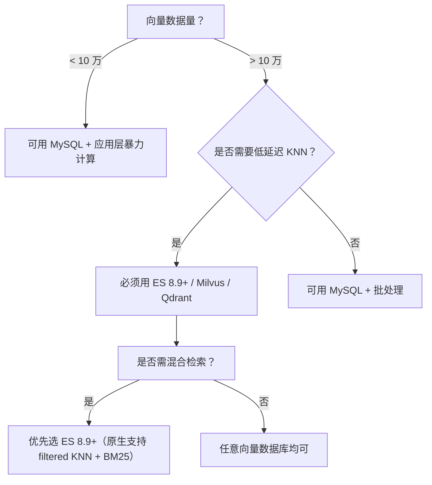

先看第二个项目，第一个项目就是很经典的八股。

想到之后还有很多场景题，脑袋就要爆炸。

具体来说，我的项目怎么实现状态管理的？基于Redis作为状态机，因为我们的过程其实是线性的，只要维持好，在失败的时候重试就行了。

Redis里面也有失败重试的计数器。

请你介绍一下异步回调机制，并且介绍，如果回调失败，怎么保证不丢失任务，如何保证重试机制的可靠性。

[Qwen](https://www.qianwen.com/share/chat/a72553ae0ece428dae88203dc42defef)，我们的千问的回答还是挺不错的。
回调也不可靠，
- 首先我们要保证幂等性
- 其次，我们需要重试机制，采用指数退避的策略
- 最后，我们还要超时任务监控

最后，我们应该选择乐观接受，但是悲观验证的策略。

我想知道MySQL能不能存储向量数据？

采用基于KNN&关键词的混合检索的时候，怎样避免大数据下的性能瓶颈，


其实就没有什么数据规模这个问题， 但是我必须要考虑啊

非常好的问题！你实际上在思考两个关键的技术选型与架构问题：

1. **向量数据是否必须依赖 Elasticsearch（或专用向量数据库）来持久化？MySQL 能否胜任？**  
2. **在 KNN + 关键词混合检索场景下，如何应对大数据量的性能瓶颈？**

下面我将从**原理、能力对比、适用边界、工程建议**四个维度为你系统解答。

---

## 一、MySQL 能不能存储向量数据？

### ✅ 答案：**可以存储，但“能否高效检索”是关键区别**

### 1. **存储层面：完全可行**
MySQL 从很早版本就支持以多种方式存储向量（即浮点数数组）：

| 存储方式 | 说明 | 优缺点 |
|--------|------|--------|
| `BLOB` | 将 float32 数组序列化为二进制（如用 NumPy 的 `.tobytes()`） | ✅ 空间紧凑❌ 需应用层反序列化，无法直接计算 |
| `JSON` | 存为 `[0.1, -0.5, ..., 0.8]` | ✅ 可读性强❌ 占空间大，解析慢 |
| 多列 `FLOAT` | 如 `vec_0`, `vec_1`, ..., `vec_767` | ✅ 可直接参与 SQL 计算❌ 表结构臃肿，维护困难 |

> 🔸 **MySQL 9.0+（2024 年发布）正式引入 `VECTOR` 数据类型**，语法示例：
> ```sql
> CREATE TABLE docs (
>   id INT PRIMARY KEY,
>   content TEXT,
>   embedding VECTOR(768)  -- 原生向量类型
> );
> ```
> 但截至 2026 年初，其功能仍较基础：**支持存储和简单距离计算，但无 ANN 索引（如 HNSW）**。

---

### 2. **检索层面：致命短板——缺乏近似最近邻（ANN）索引**

- **暴力搜索（Brute-force）**：
  ```sql
  SELECT id, content,
    (embedding <-> @query_vec) AS distance  -- 假设有距离函数
  FROM docs
  ORDER BY distance
  LIMIT 10;
  ```
  - 时间复杂度：**O(N × D)**，N=数据量，D=维度
  - **10 万条数据可能还能忍（几百毫秒）**
  - **100 万条以上基本不可用（几秒到几十秒）**

- **对比专业向量数据库（如 Milvus、Pinecone、ES 8.x）**：
  - 使用 **HNSW、IVF、DiskANN** 等 ANN 算法
  - 查询复杂度降至 **O(log N)** 或常数级
  - 百万级数据 ** 📌 **结论**：  
> **MySQL 可作为“向量存储的临时方案”或“小规模验证”，但不能作为生产级向量检索引擎。**

---

## 二、是否需要依赖 Elasticsearch 做持久化？

### ❌ 不一定“依赖 ES 持久化”，但**强烈建议用 ES（或专用向量库）做向量检索**

你可以采用 **“双写”或“主存分离”架构**：

| 组件 | 职责 |
|------|------|
| **MySQL** | 存储业务元数据（image_id, ocr_text, category, user_id 等）✅ 强一致性、事务、复杂关联查询 |
| **Elasticsearch / Milvus** | 存储向量 + 支持 KNN 检索✅ 高效语义搜索、混合检索 |

### 推荐架构（你的项目适用）：


**优点：**
- MySQL 保证业务数据一致性
- ES 专注高性能检索
- 解耦，各自可扩展

> 💡 如果你**不想引入新组件**，且数据量 < 10 万，可用 MySQL + 应用层缓存（如 Redis 缓存热门向量）+ 定期批量计算缓解压力。但这是妥协方案。

---

## 三、KNN + 关键词混合检索的大数据性能优化策略

你在做 **“先过滤（关键词/标签），再语义排序”**，这是典型 **filtered hybrid search** 场景。以下是应对大数据瓶颈的核心方法：

---

### ✅ 策略 1：使用支持 **Filtered KNN** 的引擎（首选）

#### Elasticsearch 8.9+ 原生支持：
```json
{
  "knn": {
    "field": "text_vector",
    "query_vector": [...],
    "k": 10,
    "filter": {
      "term": { "category": "invoice" }
    }
  }
}
```
- **在 HNSW 图遍历时直接跳过不符合 filter 的节点**
- **单次查询完成，性能接近纯 KNN**

> ⚠️ 注意：旧版 ES（<8.9）不支持，需两阶段查询（性能差）

---

### ✅ 策略 2：两阶段检索（Fallback 方案）

适用于不支持 filtered KNN 的系统（如早期 ES、自建 MySQL 方案）：

1. **第一阶段：用关键词/标签快速过滤**
   ```sql
   SELECT id FROM mysql_table WHERE category = 'invoice' AND create_time > '2025-01-01';
   -- 得到 1 万个 ID
   ```
2. **第二阶段：在向量库中只对这 1 万个做 KNN**
   - 向量库需支持 **ID 列表过滤**（Milvus、Qdrant、新版 ES 都支持）
   - 或将 ID 列表转为布尔向量 mask（不推荐，内存爆炸）

> 📉 缺点：两次网络往返，且第一阶段结果集不能太大（建议 < 10 万）

---

### ✅ 策略 3：预分区（Pre-partitioning）

- 按业务维度（如 `category`, `tenant_id`）**分多个向量索引**
  - `es_index_invoice`
  - `es_index_contract`
- 查询时**直接路由到对应索引**
- 相当于把“过滤”提前到索引选择阶段

> 适合类别少、分布均衡的场景

---

### ✅ 策略 4：降维 + 量化（牺牲精度换速度）

- 使用 **PCA** 将 768 维 → 256 维
- 或使用 **Product Quantization (PQ)** 压缩向量（Milvus/Qdrant 支持）
- 可提升 2–5 倍吞吐，精度损失通常 < 3%

---

### ✅ 策略 5：缓存 + 异步更新

- 对高频查询的向量结果做 **Redis 缓存**（key = query_vector_hash + filter_params）
- 向量更新采用 **异步队列**（如 Kafka → ES sync worker）
- 保证写入不影响检索性能

---

## 四、最终建议：技术选型决策树



---

## 总结

| 问题 | 结论 |
|------|------|
| **MySQL 能存向量吗？** | ✅ 能存，但不能高效检索（无 ANN 索引） |
| **必须用 ES 持久化吗？** | ❌ 不必须，但**强烈建议用 ES 或专用向量库做检索**，MySQL 存元数据 |
| **大数据混合检索性能瓶颈？** | ✅ 用 **ES 8.9+ filtered KNN**✅ 或 **两阶段检索 + 向量库 ID 过滤**✅ 避免在 MySQL 中做向量计算 |

> 🔥 **对你项目的最佳实践**：  
> **MySQL 存 OCR 文本、图片元信息；Elasticsearch 8.9+ 存向量 + clean_text，用 `knn + filter` 实现高效混合检索。**

如果你告诉我你的数据规模（比如每天多少图片？总向量数？响应时间要求？），我可以给出更具体的架构建议。
