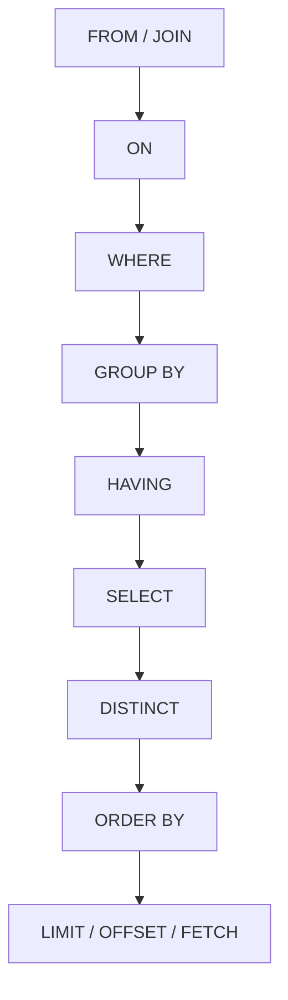

不去安装了，

我一开始恍惚了，奇怪为什么我看不到PaiSmart这张表，结果是我的DataGrip出现问题了。

## 检索慢

MySQL出现问题的原因。

全表查询，查询复杂，多层JOIN或者嵌套子查询，或者单表数据量过大。

可以添加索引解决这个问题，对于热点数据，可以使用Redis缓存，减少访问数据库的压力。


数据库的范式，简单介绍前三个，

 [范式.md](范式.md) 

建表的时候，应该考虑范式，当然，在读多写少的场合下也可以适当反范式。

字符集优先选择utf8mb4，也就是我们刚才看到的内容。

```sql
CREATE TABLE users (
                       id BIGINT AUTO_INCREMENT PRIMARY KEY COMMENT '用户唯一标识',
                       username VARCHAR(255) NOT NULL UNIQUE COMMENT '用户名，唯一',
                       password VARCHAR(255) NOT NULL COMMENT '加密后的密码',
                       role ENUM('USER', 'ADMIN') NOT NULL DEFAULT 'USER' COMMENT '用户角色',
                       org_tags VARCHAR(255) DEFAULT NULL COMMENT '用户所属组织标签，多个用逗号分隔',
                       primary_org VARCHAR(50) CHARACTER SET utf8mb4 COLLATE utf8mb4_bin DEFAULT NULL COMMENT '用户主组织标签',
                       created_at TIMESTAMP DEFAULT CURRENT_TIMESTAMP COMMENT '创建时间',
                       updated_at TIMESTAMP DEFAULT CURRENT_TIMESTAMP ON UPDATE CURRENT_TIMESTAMP COMMENT '更新时间',
                       INDEX idx_username (username) COMMENT '用户名索引'
) ENGINE=InnoDB DEFAULT CHARSET=utf8mb4 COMMENT='用户表';
```

多次强调如此排序。

数据量大的时候要分表。

char 比varchar灵活很多。

blob存储二进制数据，text存储文本数据。实际运行过程中，往往存储在OSS中，就比如说，我也办了一个阿里云OSS的服务。

DIFF between DATETIME & TIMESTAMP

前者存储日期和时间的完整值，与时区无关，后者存储Unix时间戳。

## exists vs in

```sql
SELECT * FROM user
WHERE id  IN (SELECT user_id FROM orders WHERE amount > 100);

SELECT * FROM user u
WHERE EXISTS (SELECT 1 FROM orders o 
             WHERE o.user_id = u.id AND o.amout > 100);
```

当使⽤ IN 时，MySQL 会⾸先执⾏⼦查询，然后将⼦查询的结果集⽤于外部查询的条件。这意味着⼦查询的结果集需要全部加载到内存中。

⽽ EXISTS 会对外部查询的每⼀⾏，执⾏⼀次⼦查询。如果⼦查询返回任何⾏，则 EXISTS条件为真。 EXISTS 关注的是⼦查询是否返回⾏，⽽不是返回的具体值。

## 货币

使用DECIMAL存储，

如

```sql
CREATE TABLE orders (
	id INT AUTO_INCREMENT,
amount DECIMAL(19,4),
PRIMARY KEY (id));
```

如果是银行，可以直接使用 分 作为单位，存储为 BIGINT，展示的时候需要变化。

不推荐使用浮点数，因为存在精度问题。

## 怎么存储emoji? 

😛🐩🦙🐎🦍🐖

答案就是，使用 utf8mb4字符集。

```sql
ALTER TABLE test CONVERT TO CHARACTER SET utf8mb4 COLLATE utf8mb4_unicode_ci
```

大小写不敏感。

## drop , delete , truncate的区别

DROP 物理删除

DELETE 行级删除，可以带条件和回滚

TRUNCATE 清空数据，保持表结构，不能回滚。

## select(1)

和select(*)并没有差异。

## sql执行顺序

 [执行顺序.md](执行顺序.md) 




| 步骤 | 子句             | 作用                                         | 为何在此阶段执行                               |
| ---- | ---------------- | -------------------------------------------- | ---------------------------------------------- |
| 1    | `FROM` / `JOIN`  | 确定数据源表，并进行表连接                   | 必须先知道“从哪取数据”，才能后续过滤或计算     |
| 2    | `ON`             | 指定 JOIN 的连接条件                         | 连接时需立即应用条件，决定哪些行能组合在一起   |
| 3    | `WHERE`          | 对连接后的行进行**行级过滤**                 | 在分组前剔除无关数据，减少后续处理量           |
| 4    | `GROUP BY`       | 将数据按指定列分组                           | 聚合操作（如 SUM、COUNT）需要先分组            |
| 5    | `HAVING`         | 对**分组后**的结果进行过滤                   | WHERE 无法访问聚合函数，故需在 GROUP BY 后过滤 |
| 6    | `SELECT`         | 选择要返回的列，可包含表达式、别名、聚合函数 | 此时已有完整中间结果集，可安全投影字段         |
| 7    | `DISTINCT`       | 去除重复行                                   | 在 SELECT 投影后去重，避免多余计算             |
| 8    | `ORDER BY`       | 对最终结果排序                               | 必须在所有行确定后才能排序                     |
| 9    | `LIMIT / OFFSET` | 限制返回行数（分页）                         | 最后一步，仅取所需部分                         |

## 常用函数

```sql
CONCAT()
LENGTH()
SUBSTRING()
REPLACE()
TRIM()
ABS()
ROUND()
MOD()
CURDATE()
SUM()
AVG()
COUNT()
IF(CONDITION, RESULT)
CASE
```


```SQL
SELECT IF(1 > 0, 'True', 'False') AS simple_if
SELECT CASE WHEN 1 > 0 THEN 'True' ELSE 'False' END 
```

## 隐式类型转换

正数和浮点数->浮点数

字符串和整数->整数

最好使用显示转换来规避。