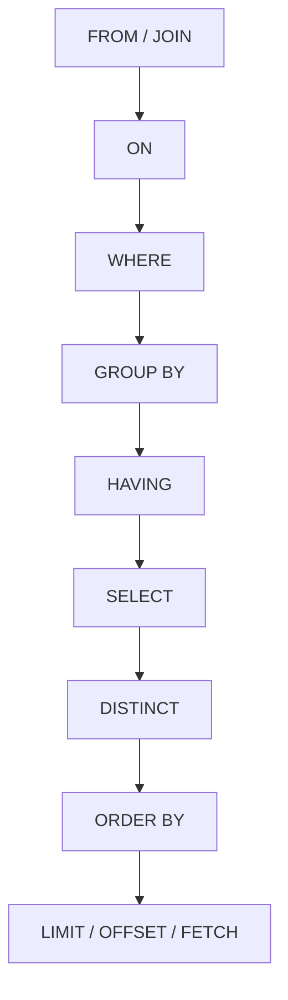

SQL 的逻辑执行顺序（Logical Query Processing Order）与我们书写 SQL 语句的语法顺序**并不一致**。理解这一顺序对编写正确、高效的查询至关重要。

下面先用 **Mermaid 流程图**展示 SQL 的标准逻辑执行顺序，然后解释**为何如此设计**。

---

### ✅ SQL 逻辑执行顺序（Mermaid 图）



> 💡 注意：这是**逻辑执行顺序**，不是数据库物理执行顺序。数据库优化器可能会重排操作以提升性能，但必须保证结果与逻辑顺序一致。

---

### 📌 各子句说明与执行原因

| 步骤 | 子句             | 作用                                         | 为何在此阶段执行                               |
| ---- | ---------------- | -------------------------------------------- | ---------------------------------------------- |
| 1    | `FROM` / `JOIN`  | 确定数据源表，并进行表连接                   | 必须先知道“从哪取数据”，才能后续过滤或计算     |
| 2    | `ON`             | 指定 JOIN 的连接条件                         | 连接时需立即应用条件，决定哪些行能组合在一起   |
| 3    | `WHERE`          | 对连接后的行进行**行级过滤**                 | 在分组前剔除无关数据，减少后续处理量           |
| 4    | `GROUP BY`       | 将数据按指定列分组                           | 聚合操作（如 SUM、COUNT）需要先分组            |
| 5    | `HAVING`         | 对**分组后**的结果进行过滤                   | WHERE 无法访问聚合函数，故需在 GROUP BY 后过滤 |
| 6    | `SELECT`         | 选择要返回的列，可包含表达式、别名、聚合函数 | 此时已有完整中间结果集，可安全投影字段         |
| 7    | `DISTINCT`       | 去除重复行                                   | 在 SELECT 投影后去重，避免多余计算             |
| 8    | `ORDER BY`       | 对最终结果排序                               | 必须在所有行确定后才能排序                     |
| 9    | `LIMIT / OFFSET` | 限制返回行数（分页）                         | 最后一步，仅取所需部分                         |

---

### ❗ 为什么不能按书写顺序执行？

SQL 语句通常写作：
```sql
SELECT col1, COUNT(*)
FROM table
WHERE ...
GROUP BY col1
HAVING COUNT(*) > 1
ORDER BY col1
LIMIT 10;
```

但若按书写顺序执行：
- `SELECT` 在最前，但此时还不知道 `FROM` 哪张表；
- `WHERE` 在 `GROUP BY` 前，但 `HAVING` 却在 `SELECT` 之后 —— 实际上 `HAVING` 必须能引用 `SELECT` 中的聚合函数，所以逻辑上它在 `GROUP BY` 之后、`SELECT` 之后才合理。

> 🧠 **关键原因**：SQL 是**声明式语言**，用户描述“想要什么”，而非“如何做”。数据库需按**数据流依赖关系**重组操作：
> - 先有数据源（FROM）
> - 再筛选（WHERE）
> - 再聚合（GROUP BY + HAVING）
> - 最后投影和排序（SELECT → ORDER BY → LIMIT）

---

### 💡 实用影响举例

1. **别名不能在 WHERE 中使用**：
   ```sql
   SELECT name AS n FROM users WHERE n = 'Alice'; -- ❌ 错误！
   ```
   因为 `WHERE` 在 `SELECT` 之前执行，`n` 尚未定义。

2. **HAVING 可用聚合函数，WHERE 不行**：
   ```sql
   SELECT dept, AVG(salary)
   FROM employees
   GROUP BY dept
   HAVING AVG(salary) > 5000; -- ✅ 正确
   ```

3. **ORDER BY 可用 SELECT 别名**：
   ```sql
   SELECT salary * 12 AS annual FROM emp ORDER BY annual; -- ✅ 允许
   ```
   因为 `ORDER BY` 在 `SELECT` 之后逻辑执行。

---

### 总结

SQL 的逻辑执行顺序是围绕**数据处理的依赖关系**设计的：  
**从数据源 → 过滤 → 分组 → 投影 → 排序 → 截断**，  
确保每一步都有其所需的数据上下文，同时兼顾效率与语义一致性。

掌握这一顺序，能避免常见错误，并写出更清晰、高效的 SQL。