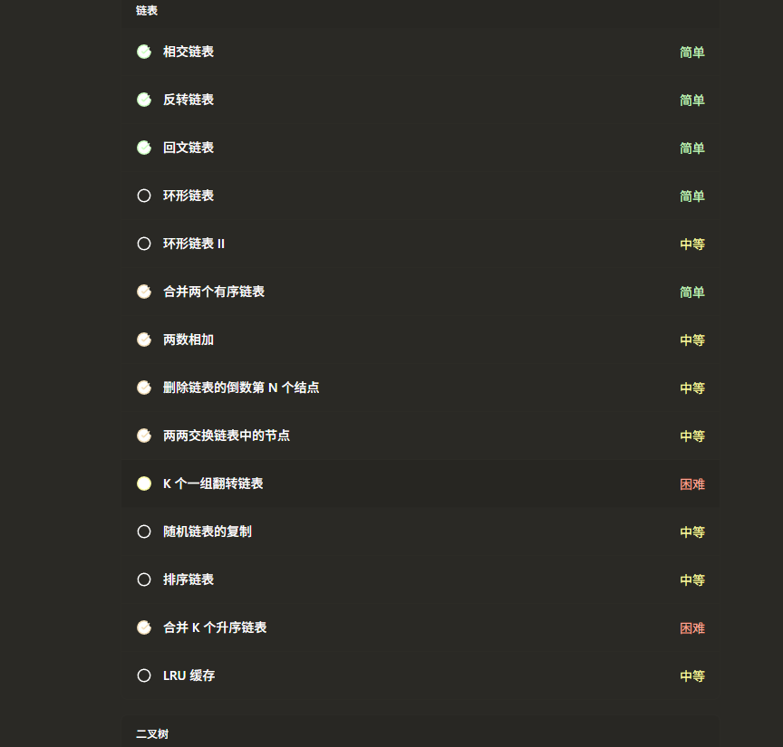

我草，使用飞书面试，结果太紧张，忘记录音了。

简单说一下流程。介绍自己的项目，之后面试官来拷打，之后就是一些很基础的题目。

面试官只拷打了不到十分钟。

我的项目可能太简单了，面试官都没有什么询问的。他询问了项目的数据是怎么同步的，也就是我MySQL和Elasticsearch当中的数据是怎么同步的？

比较好的方式，当然是通过数据库的自动同步操作……等一下，我找到了，原来有这样一道面试题，只不过当时没有看到。

我选择的是最糟糕的双写同步策略。比较好的方式是，使用异步策略，比如说阿里的Canal技术，这才是面试官想要听到的答案吧。当时学到这时候的时候对于WSL都还不熟悉，自己也找不到Windows上面的MySQL的配置文件，就放弃了。

或者我们使用Redis来进行。

挑一些我还记得的题目。回过头来看，都非常简单，但是，好可惜，又没有录音，现在我应该怎样回答。面试官很帅气，也很温柔，一面都是这么美好的吗？

数据库方面

MySQL的索引结构。为什么使用B+树。

联合索引的原则是什么，基于(A, B, C)建立的索引，能不能使用(B, C)查询？

Redis的Zset的实现，为什么选择跳表。

分布式ID的生成策略(不会，真的不会，我只知道UUID和雪花算法，但是两个我都不是很熟悉……)

分布式锁的实现(为什么要问我分布式，我简历里面哪里写分布式了……)

计算机网络方面

TCP & UDP的区别。

TCP 面向字节流，那么具体是怎样实现的。中文输入法的

Java就问了，Java8当中的HashMap 和Java7当中有什么区别(没有背……)

Spring就询问了一下，为什么要使用Spring这个框架，它解决了什么问题。(IoC，AOP，除了吐出来两个缩写之后，我也没有办法了，当时脑袋晕了，差点不记得IoC 是控制反转。)

之后就是算法题。

两道题都做的不是很高。一道是做过的三数之和的题目，需要使用双指针，但是我忘记考虑数组越界的情况，就直接水淋淋

```java
while (nums[j++] == nums[j])
```
凉。

第二道题就更加逆天了，我真的没有见过，需要我手搓LRU。这个东西不是太难，但是，但是我真的没有手写过。

好在我没有给面试官直接说我不会。面试官也非常温柔。最后我测试代码死活无法通过，然后面试官提醒我，我才知道怎样修改。

我好像两道题做了一个小时，感谢面试官，不然包写不出来。

「你76行 `tail` 好像没有初始化……」

我待会要重写一下这道题。

面试的表示并不好，反问的时候提问

我的面试表现怎样？
- 现在不方便回答。

什么时候下一次面试？
- 我会给你打分。
- 应该就在这一两天。

我还有哪些方面需要提高？
- 数据结构
- 就比如说，你做的两道算法题。



命啊，晚上才看到，这就是命啊，还是链表，当时为什么不刷完呢？