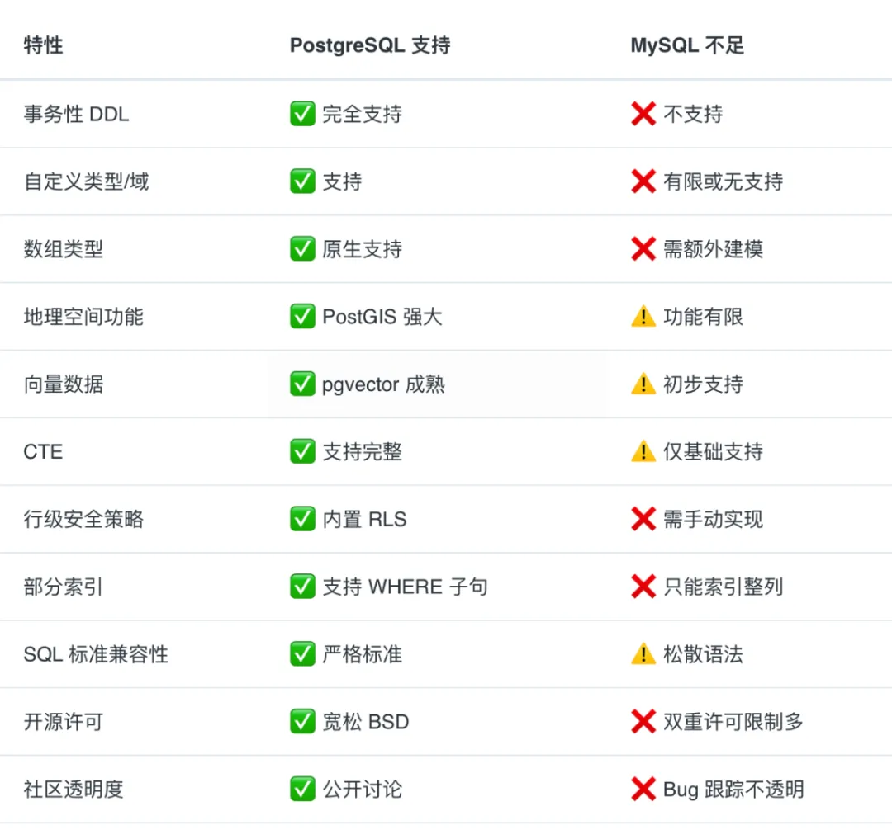

[MySQL 被干成老二了？](https://mp.weixin.qq.com/s/APWD-PzTcTqGUuibAw7GGw)

写的很好，我也感觉非常正确，但是，没有什么但是，写得就是很好。

原子能也是这么认为的。

不过上面这篇文章其实对于MySQL的批判还不够彻底。

早一点知道它的强大，老子直接拿这个数据库开发……

开玩笑的，还是需要面向就业。

没关系，好好学习就是了。

- **AI 向量检索？** 有官方推荐的 **pgvector** 扩展，性能强大，生态成熟，足以媲美专业的向量数据库。
    
- **全文搜索？** 内置支持（能满足基础需求），或使用 **pg_bm25** 等扩展。
    
- **时序数据？** 有顶级的 **TimescaleDB** 扩展。
    
- **地理信息？** 有行业标准的 **PostGIS** 扩展。

反正看起来是有一点难绷。

我看了半天，还是感觉Typora的即时渲染真的是一个伟大的发明，但是我也不知道。