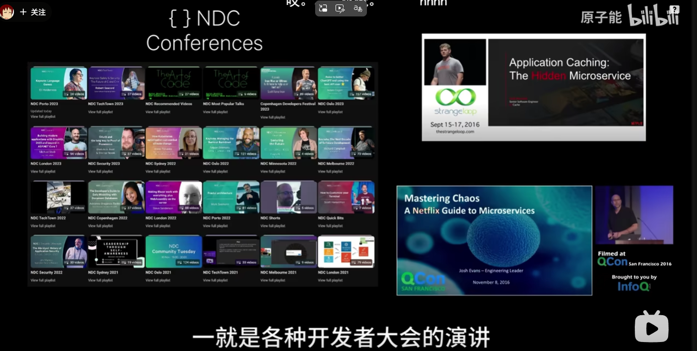
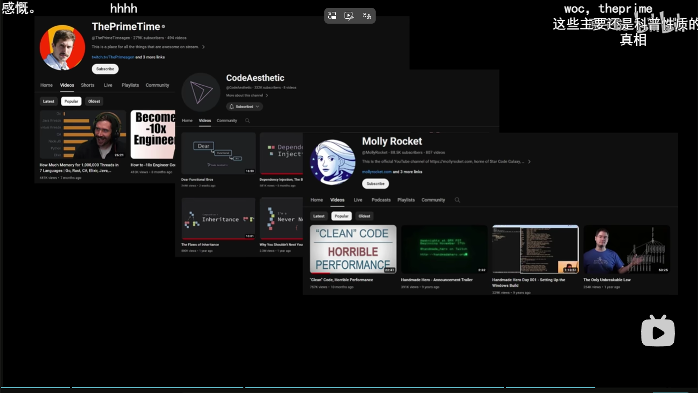

最重要的原因是，英语的资源，真的非常多，很幸福！

中文社区的内容相对非常匮乏，学好英语很重要。

作者推荐了怎样的社区呢？

比如说reddit，还有

绝大技术的发源都来源于英语，如果你不会英语，就只能等有人翻译。但是，这种东西大部分的时候只能看运气。

英语一定要好。

足够覆盖度的答疑

细分领域的技术拓展

丰富的场景应用经验。

所以，之后我也会考虑去看一下英文社区，看一下源码，看一下英文的注解。

不需要那么多翻译的，就好像，一个脚本，不需要考虑太小白的人。

GraphQL，为什么不火。

明明已经在国外已经很火了，中文社区还是非常初始的启蒙的阶段。

老东西也是在进步的，就好像Python2 & Python3的进步。

乃至Java8 → Java9 之后背刺我们的OOP的教徒

好图，好像知道这些梗图是从哪里来的。

学会英语，可以更快积累经验。

吸取别人的经验，英语社区是很好的方法。

从开发者大会的演讲当中吸取经验。

 
 还有那些资深的技术博主。
 
国内的的开发者大会就很好笑，无论是深度还是广度上面。更有趣的就是，拿着一个全是英文的演示文档讲中文。

之前，一些技术博主，说实话嘛，进步空间都很大。up主好大的口气！但是，我觉得这个up主配！

