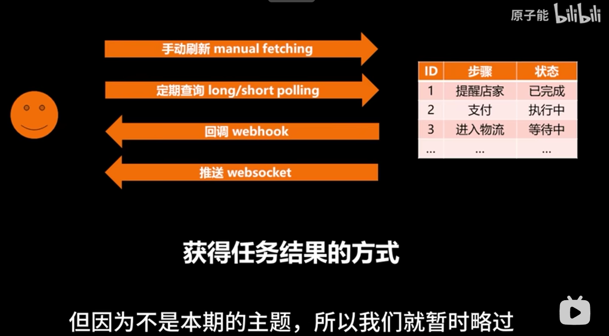

我爱 原子能！

大家好，这里是原子能。本期分享的技术是第十期里面提到的，能让 API 的响应效率提升10倍的异步架构。当然，异步架构不只是拿来写 API 的，它的优点也不只是在速度。它的真正价值在于降低代码的复杂度，对功能组件进行解耦。所以当你的软件越复杂，就越能够体现出异步架构的优点。

  

图灵奖得主 Michael Stonebreaker 说过：“The full logic is only about 10% of the code, everything else is 90%.” 意思就是在现实场景里面，软件本来要做的事情一般只占代码很小的部分，因为它们通常都是很直接了当的。就比如说在一个电商平台上面去购买一个商品，这个下单行为，从订单的生成、库存的锁定、支付完成、库存扣除、订单进入到物流环节、向店家推送消息，以及到最后订单更新到最新状态——这整一个流程，每一步都可以用简单的几十行代码完成。尤其是物流提醒这些一般都会用第三方服务的环节，可能就是一行调用第三方 API 的代码。

  

但是呢，现实一般都不会这么顺利的，因为每一个环节都有可能出错。如果有几个人同时下单导致库存冲突，它的处理方法应该是怎样？如何判定先后顺序？如果某个步骤在运行中出错，这个步骤或者它之前的步骤中已经改掉的数据要不要回滚？怎样回滚？什么情况下回滚到哪一步？如果某个步骤的执行用时不准确，要不要给它设置超时规则？多长时间算超时？如果某一个第三方服务返回的是故障码，我们应该直接报错还是重试？重试的话用什么频率？

  

诸如此类的问题可以说是占据了90%的设计上的考虑、代码以及开发和运维成本。传统的同步架构要一口气从第一步执行到最后一步，所以当它要考虑到意外情况、突发情况的时候，就会从一条简单的线性流程变成一团箭头交错、分支非常复杂的乱码。这种设计的核心问题就在于，所有的步骤都是捆在一根绳上的蚂蚱，只要一个出问题全部都会受影响，而且这些影响会叠加，造成更难以计算的后果。

  

所以很多人在应对这些复杂问题的时候，都选择一条化繁为简的道路，那就是甭管哪一步出了什么问题，直接就终止。这样我就想起了我年轻时候管理缓存的做法：只要有一丁点的风吹草动，我就把整个缓存都清空。这样虽然缓存命中率低了，但是绝对不会有之后错误的缓存数据，所以永远都不会出事。当然，这种化繁为简的做法大大地侮辱了我们程序员的智商，也很容易成为一个性能的瓶颈，甚至会阻碍一些特定业务逻辑的处理。

  

所以正确的解决方法就是抛弃这种同步的架构，而去拥抱异步架构。

  

首先，异步这个概念，大多人更熟悉的应该是在代码的层面。一些编程语言的异步执行机制，通过 `async`、`await` 之类的关键词，能够让等待时间比较长的代码把 CPU 让出来给后面的代码用，提升 CPU 的使用效率。而异步的任务执行架构，它的这种非阻塞的设计让步骤独立存在，我们删除了“等待”这个行为，统一管理和分配每一个步骤的执行，这也是开场提到过的功能组件的解耦。

  

我们继续用刚才的这个电商例子。我们可以把下单这整个任务看成一个整体，而它的一连串步骤则是里面代表状态或者进度的标识，可以用来跟踪这个任务的执行状况。这样子，当这个任务被创建的一瞬间，我们就可以立即返回结果。这也是第十七期视频里面提到的，让 API 的响应速度和稳定性上升一个等级的做法。当然，这个结果并不是最终结果，因为此时它还有很多步骤要等着执行。所以我们的任务就需要根据这个 ID 回来获取任务的真正的结果。获取的方法有很多，但因为不是本期的话题，所以我们就暂时略过。

  

那此时我们的架构就有很明确的两个部分，我们可以把它们叫做管理池和任务池。管理池只负责管理任务，而任务池就负责分配这些资源来处理任务。这里的概念有点像是分布式的数据处理框架，比如说 Hadoop 框架里，这样区分的一个价值在于我们可以灵活地分配资源，去独立处理每一个任务的每一个步骤。比如说，第三方的物流接口如果它比较繁杂，录入物流这个事件它的耗时会比较长，就可以投入更多的资源，同时处理多个录入物流的任务。要是遇到购物节之类的高峰期，我们甚至可以把整个任务池都扩容。

  

另一个常见的情况就是任务出错，需要重新分配资源进行重试。有的时候，重试甚至都不是一种错误，而是一种我们主动选择的机制。比如说我们要确定一个订单它的支付是否完成。第三方支付接口一般会提供两种方式：一种是你在支付的时候打包发送一个回调地址，对方就会在支付真正完成了之后，把这个结果推送到你这个地址；另一个方法就是你可以直接调用 API 去查这个订单的具体状况。

  

简单听起来，第一种方法是更方便的。但是在现实中，第一种方法是非常不靠谱的，因为这种通知是没有任何保障的。这种我们一般称之为 “at most once delivery”，它不保障它发了，你也不保障你收到了，主打的就是一个随缘。所以就连微信支付都在官方文档里面警告大家不要依赖这种通知。最安全也是最合适的方法，就是直接查询订单的状态。如果现在这个订单还没有结果，那我过一会儿再查。

> 指数重试的回退机制在大多数情况下是没有问题的，反过来说，查询更多只是兜底。

  

至于这种重试的频率，常见的手法就是设定一个公式，让这个重试的等待时间一样，或者是逐步延长。当然，这种做法还是有缺陷的。因为如果是第三方的接口它宕机了，那么我们在短时间内就会积累大量的失败，然后这些失败的重试也会失败，滚雪球下去就会形成大量的堆积，就会造成疯狂的资源侵蚀。

  

所以最好的重试机制还是要回归到我们现在这个架构。这样我们有一个分配任务的任务池，那么很简单，我们也可以专门划分一个去处理重试的重试池。和任务池类似，我们可以灵活地分配这里的资源。当遇到刚才提到这种支付接口故障的情况，我们就可以直接暂停分配资源给这些重试支付的任务，让他们都乖乖地待着，反正现在试也是白试。等到支付接口恢复了正常，我们就可以像刚才的物流的例子一样，分配更多的资源，把这些滞留的任务全部都清理了。

  

那么基本上，这个架构到现在就已经定型了。所以问题就来了，这个东西要怎么造？

  

打造这种异步的任务流水线，最需要解决的就是负责登记任务、跟踪进度、分配资源和进行调度的这一部分。最好的解决方案就是消息队列框架，比如说我最喜欢的 RabbitMQ。比起更有名的 Kafka，RabbitMQ 虽然在速度上没有那么快，但胜在功能非常丰富。比如它有非常灵活的、可以指定 Consumer 的 Topic Routing 功能，可以很方便地把完成一个步骤的任务推送到下一个步骤所在的队列里面。RabbitMQ 还有非常完善的 Acknowledgement 功能，它可以让你在 Producer 和 Consumer 两端都确保这个任务分配完成了，以及接收完成了。这就是前面提到的 Exactly Once Delivery。它甚至自带了一个完整的权限管理系统，可以单独地去管理每一个队列的读和写的权限，这简直就是运维团队的最爱。

  

那么是不是在所有情况下都应该用 RabbitMQ？那肯定不是的。就如同我在第二期视频里面提到过了，一个项目里面用的技术栈是越少越好。所以如果这个项目现在没有用上消息队列的系统，那么与其专门搭建一个 RabbitMQ 的集群，我宁愿利用手头上现有的技术栈去实现类似的功能。比如说，每一个项目都会有数据库，你可以用数据库现有的功能实现一个简易的事件驱动机制。当然前提是你用的这个数据库足够靠谱，比如说世界上最好的数据库 PostgreSQL，而不是 MySQL 之类的这种残次品。

  

因为事件驱动的核心是触发机制和推送机制，两者是缺一不可的。PostgreSQL 的触发器其实没有很神奇，它至少按照了 SQL 的标准来进行运作。MySQL 的触发器有一个非常臭名昭著的 bug，导致它在一些基本情况下是完全无法运作的。至于推送机制，PostgreSQL 有一组叫做 `NOTIFY` 和 `LISTEN` 的命令，没有 RabbitMQ 那么强大，但是也能做到基本的一个事件驱动。而 MySQL 则完全没有这种玩意儿。

  

画面里是我最近几年比较常用的一个系统设计的方案，可以说是一个最小化的异步架构，这也算是麻雀虽小，五脏俱全。我甚至建议，如果你有机会的话，一定要尝试一下自己去实现这些功能，因为这样子能够大大加深你对消息队列、事件驱动这种常见的技术原理的认识。

  

自从本系列视频的第一期我分享了架构师的心理历程之后，就一直有观众私信我，要我分享一些具体的架构设计的经验。但这是一个很难做的话题，因为架构是一个宏观上来说很简洁，但又处处包含细节的东西。比如本期视频说的这个异步任务执行的架构也是这样。鉴于时间关系，里面有很多细节我都没法深入探讨，还有一些是需要跟具体的场景结合、随机应变的，你也没办法三言两语说得干净。

  

所以本期视频的很多内容都放在了“为什么”这个问题上：为什么做这个决策？为什么要考量这些问题？我觉得这些讨论远比手把手教你写几行代码更有意义。因为思考的角度和方向是直接决定了这个架构的成败。你走错方向了，你就算用最成熟的技术框架，你写出来最优化的代码也没有什么意义。

  

下一期我们就继续讨论架构设计，继续 Make Programming Great Again。拜拜。

  

---

  

好的，这是对上述文字内容的分层总结：

  

**核心论点：异步架构是应对复杂软件系统、提升API效率及降低代码复杂度的关键方案。其真正价值在于通过解耦功能组件来简化整体设计，而非仅仅追求速度。**

  

**一、同步架构的困境与异步架构的必要性**

  

**现实世界软件的复杂性：**

核心业务逻辑（如电商下单流程）本身可能简单，但错误处理、并发控制、超时、重试等占据了90%的设计与代码量。

同步架构下，所有步骤串联执行，任何环节出错都可能导致整个流程失败，且问题会叠加，形成复杂难以维护的“乱码”。

简单的“一刀切”错误处理（如直接终止或清空缓存）有损程序健壮性和性能。

**异步架构的引入：**

是抛弃传统同步架构，应对复杂性的正确方法。

通过非阻塞设计，让任务步骤独立存在，统一管理和分配执行，实现功能解耦。

  

**二、异步架构的核心理念与优势**

  

**降低代码复杂度与功能解耦：*这是异步架构的首要价值，软件越复杂，优势越明显。

**提升API响应效率与稳定性：**

任务创建后可立即返回初步结果（如任务ID），后续状态通过ID查询。

CPU利用率提升：长时间等待的I/O操作不会阻塞CPU，可让出给其他任务。

**任务的独立性与追踪：**

将复杂任务（如电商下单）分解为一系列独立步骤。

通过状态或进度标识来跟踪任务执行情况。

  

**三、异步任务执行架构的设计与实现**

  

**核心组件：**

**管理池 (Management Pool)：*负责登记任务、跟踪进度、资源分配和调度。

**任务池 (Task Pool)：*负责实际执行任务，可根据需求（如高峰期、复杂任务）灵活分配和扩容资源。

**错误处理与重试机制：**

**回调通知的不可靠性：*第三方回调（at most once delivery）不可靠，不应作为关键业务状态确认的唯一依据（如支付完成）。

**主动查询：*直接查询状态是更安全可靠的方式。

**健壮的重试策略：**

避免简单的固定频率或无限延长重试，以防第三方服务宕机导致资源耗尽。

设立专门的“重试池”，可灵活管理重试任务资源。

在第三方服务故障时，可暂停向相关重试任务分配资源，待恢复后再集中处理。

**构建工具与技术选型：**

**消息队列框架 (Message Queue)：**

**RabbitMQ：*功能丰富（灵活路由、ACK机制、权限管理），适合复杂消息处理，即使速度可能不及Kafka。

**Kafka：*速度快，但RabbitMQ在功能全面性上更受青睐。

**数据库作为事件驱动机制：**

**原则：*尽量减少项目技术栈。若无现有消息队列，可利用数据库实现。

**PostgreSQL：*被誉为“世界上最好的数据库”，其`NOTIFY`/`LISTEN`机制和符合SQL标准的触发器，使其能实现基本的事件驱动，是可靠的选择。

**MySQL：*被批评为“残次品”，其触发器存在臭名昭著的bug，且缺乏类似`NOTIFY`/`LISTEN`的推送机制，不适合构建可靠的事件驱动。

  

**四、架构设计的核心思维与总结**

  

**理解比实现更重要：**

架构设计的核心在于理解“为什么”做某个决策，考量哪些问题，而非仅仅是“如何”编写代码。

思考的角度和方向直接决定架构的成败；方向错误，再优化的代码也无意义。

**实践的重要性：*鼓励尝试亲手实现异步架构，以加深对消息队列、事件驱动等技术原理的理解。

**架构的复杂性与分享的挑战：*架构宏观简洁但细节繁多，很多具体场景需随机应变，难以三言两语讲清。

  

**结论：该视频倡导通过异步架构来应对现代软件开发的复杂性，强调解耦和深思熟虑的设计原则，并对相关技术工具进行了对比和评价，旨在引导开发者从“为什么”的层面思考架构设计。**
